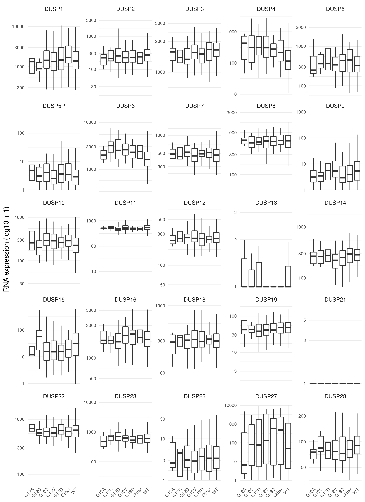
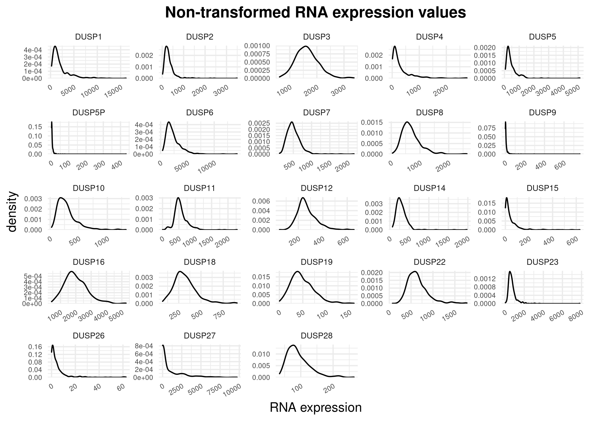
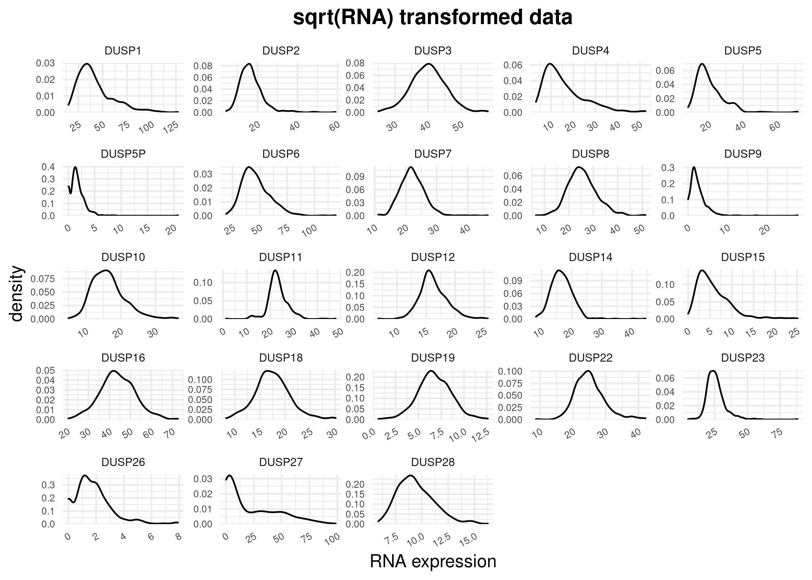
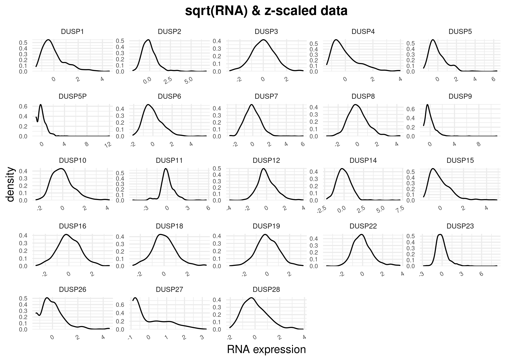
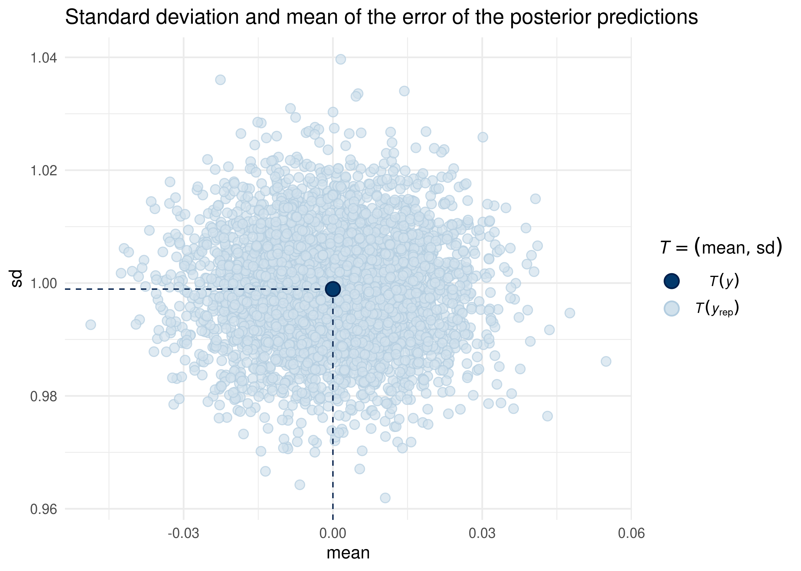
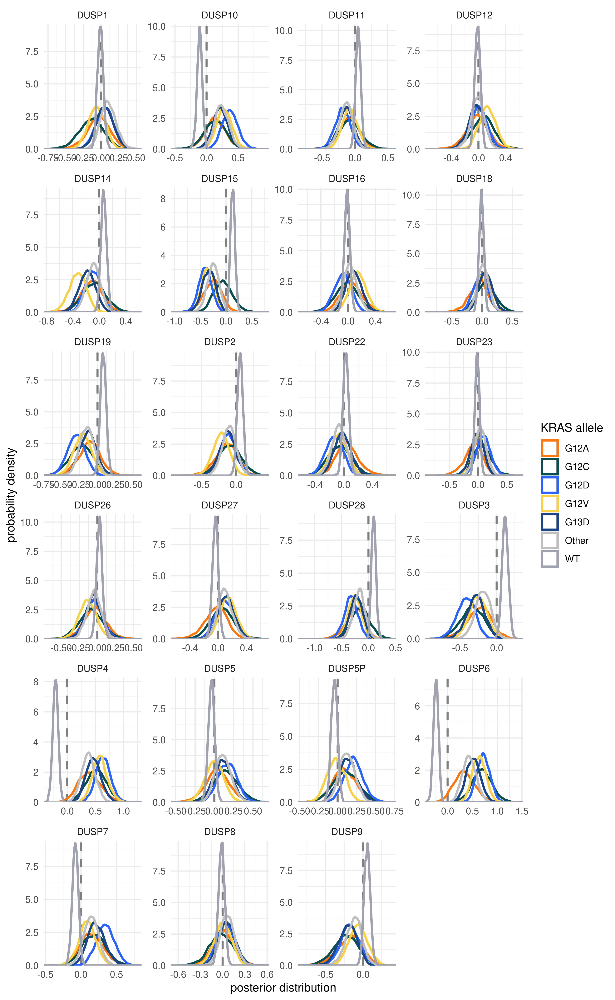
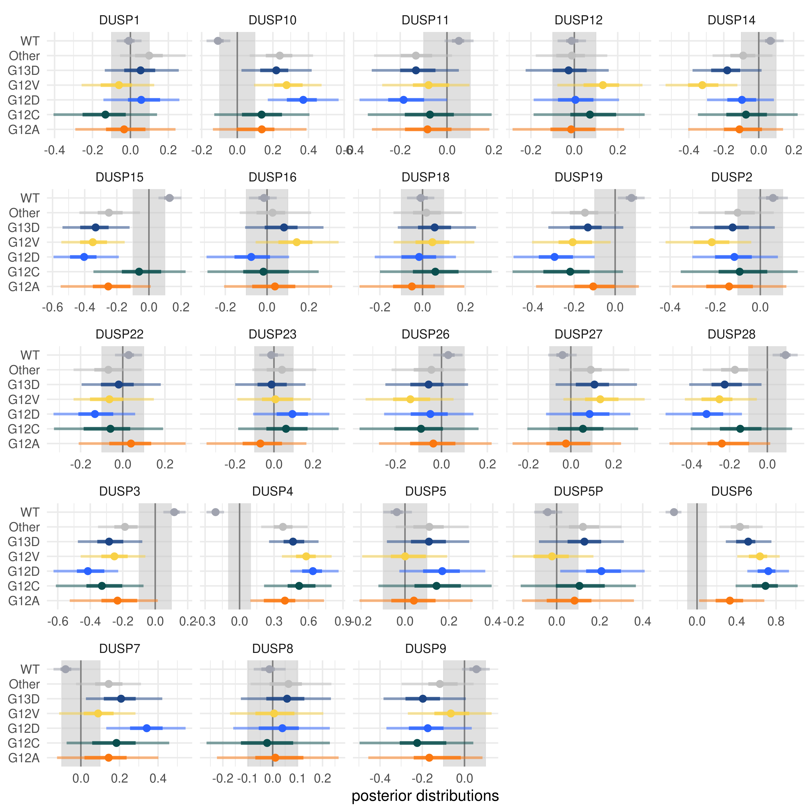

## Goals

1. List the top hits of genes that comutate with *KRAS* in CRC (non-allele-specific).
2. Compare expression levels of *DUSP* genes between *KRAS* alleles in CRC.
3. Compare expression levels of *DUSP* genes between *APC* mutants in CRC.

---

## Comutation interaction list

Below is a list of the top comutating genes with *KRAS* in CRC.
The last four columns have the number of tunor samples with the various combination of mutations; for example, `G mut & K WT` has the number of tumors with the other gene (`G`) mutated and *KRAS* (`K`) WT.


```r
nonallele_specific_increased_comutation_df %.% {
  filter(cancer == "COAD" & hugo_symbol != "KRAS")
  filter(p_value < 0.01)
  arrange(p_value)
  mutate(
    p_value = scales::scientific(p_value, digits = 3),
    odds_ratio = round(odds_ratio, digits = 3),
    geneWT_krasWT = map_dbl(comut_ct_tbl, ~ .x[1, 1]),
    geneMut_krasWT = map_dbl(comut_ct_tbl, ~ .x[2, 1]),
    geneWT_krasMut = map_dbl(comut_ct_tbl, ~ .x[1, 2]),
    geneMut_krasMut = map_dbl(comut_ct_tbl, ~ .x[2, 2]),
  )
  select(hugo_symbol, p_value, odds_ratio, tidyselect::starts_with("gene"))
  rename(
    gene = hugo_symbol,
    `p-value` = p_value,
    `odds ratio` = odds_ratio,
    `G WT & K WT` = geneWT_krasWT,
    `G mut & K WT` = geneMut_krasWT,
    `G WT & K mut` = geneWT_krasMut,
    `G mut & K mut` = geneMut_krasMut
  )
}
```

<div data-pagedtable="false">
  <script data-pagedtable-source type="application/json">
{"columns":[{"label":["gene"],"name":[1],"type":["chr"],"align":["left"]},{"label":["p-value"],"name":[2],"type":["chr"],"align":["left"]},{"label":["odds ratio"],"name":[3],"type":["dbl"],"align":["right"]},{"label":["G WT & K WT"],"name":[4],"type":["dbl"],"align":["right"]},{"label":["G mut & K WT"],"name":[5],"type":["dbl"],"align":["right"]},{"label":["G WT & K mut"],"name":[6],"type":["dbl"],"align":["right"]},{"label":["G mut & K mut"],"name":[7],"type":["dbl"],"align":["right"]}],"data":[{"1":"APC","2":"4.46e-22","3":"1.796","4":"1274","5":"1591","6":"609","7":"1366"},{"1":"PIK3CA","2":"2.31e-16","3":"1.774","4":"2353","5":"506","6":"1426","7":"544"},{"1":"SMAD4","2":"7.08e-07","3":"1.515","4":"2544","5":"321","6":"1658","7":"317"},{"1":"AMER1","2":"8.74e-07","3":"2.015","4":"1519","5":"98","6":"869","7":"113"},{"1":"TCF7L2","2":"5.15e-05","3":"1.572","4":"1996","5":"176","6":"1190","7":"165"},{"1":"PCBP1","2":"1.10e-04","3":"2.885","4":"996","5":"23","6":"480","7":"32"},{"1":"FBXW7","2":"2.75e-04","3":"1.346","4":"2501","5":"342","6":"1668","7":"307"},{"1":"SMAD2","2":"3.72e-04","3":"1.733","4":"2204","5":"80","6":"1367","7":"86"},{"1":"SOX9","2":"2.34e-03","3":"1.359","4":"2060","5":"223","6":"1244","7":"183"},{"1":"RUBCN","2":"2.59e-03","3":"14.089","4":"1018","5":"1","6":"505","7":"7"},{"1":"ANKRD45","2":"4.00e-03","3":"5.049","4":"1015","5":"4","6":"502","7":"10"},{"1":"ALS2","2":"4.19e-03","3":"2.124","4":"991","5":"28","6":"483","7":"29"},{"1":"SMAD3","2":"5.73e-03","3":"1.704","4":"1621","5":"51","6":"951","7":"51"},{"1":"MBLAC1","2":"6.87e-03","3":"12.054","4":"1018","5":"1","6":"506","7":"6"},{"1":"TMPRSS15","2":"7.87e-03","3":"1.978","4":"989","5":"30","6":"483","7":"29"},{"1":"CAPG","2":"7.92e-03","3":"3.703","4":"1013","5":"6","6":"501","7":"11"},{"1":"RNF146","2":"8.78e-03","3":"4.535","4":"1015","5":"4","6":"503","7":"9"},{"1":"MBD3","2":"8.80e-03","3":"5.369","4":"1016","5":"3","6":"504","7":"8"},{"1":"HAAO","2":"8.80e-03","3":"5.369","4":"1016","5":"3","6":"504","7":"8"},{"1":"IGHG2","2":"8.80e-03","3":"5.369","4":"1016","5":"3","6":"504","7":"8"},{"1":"P3H1","2":"8.80e-03","3":"5.369","4":"1016","5":"3","6":"504","7":"8"}],"options":{"columns":{"min":{},"max":[10]},"rows":{"min":[10],"max":[10]},"pages":{}}}
  </script>
</div>

---

## Differential expression of *DUSP* genes

The data used for this analysis was the RNA expression data from TCGA-COAD.
This data set has RNA expression for 525 tumor samples.
78 of these samples are hypermutants; these samples were removed from the analysis.


```r
main_alleles <- c("WT", "KRAS_G12A", "KRAS_G12C", "KRAS_G12D", "KRAS_G12V", "KRAS_G13D")

dusp_rna_data <- tcga_coad_rna %.% {
  filter(str_detect(hugo_symbol, "DUSP"))
  filter(!is_hypermutant)
  select(-is_hypermutant)
  mutate(
    allele = ifelse(ras_allele %in% !!main_alleles, ras_allele, "Other"),
    allele = str_remove(allele, "KRAS_"),
    allele = factor_alleles(allele)
  )
}

# Put DUSP genes in order.
dusp_order <- unique(dusp_rna_data$hugo_symbol)
dusp_num <- as.numeric(str_remove_all(dusp_order, "[:alpha:]"))
dusp_order <- dusp_order[order(dusp_num)]
dusp_rna_data$hugo_symbol <- factor(dusp_rna_data$hugo_symbol, levels = dusp_order)
```

Below is a sample of the RNA expression data table.


```r
dusp_rna_data %>%
  rename(
    `DUSP` = hugo_symbol,
    `tumor sample` = tumor_sample_barcode,
    `RNA (RSEM)` = rna_expr
  ) %>%
  select(-ras_allele) %>%
  head() %>%
  kbl() %>%
  kable_styling(bootstrap_options = c("striped", "hover"))
```

<table class="table table-striped table-hover" style="margin-left: auto; margin-right: auto;">
 <thead>
  <tr>
   <th style="text-align:left;"> DUSP </th>
   <th style="text-align:left;"> tumor sample </th>
   <th style="text-align:right;"> RNA (RSEM) </th>
   <th style="text-align:left;"> allele </th>
  </tr>
 </thead>
<tbody>
  <tr>
   <td style="text-align:left;"> DUSP10 </td>
   <td style="text-align:left;"> TCGA-3L-AA1B </td>
   <td style="text-align:right;"> 254.352 </td>
   <td style="text-align:left;"> WT </td>
  </tr>
  <tr>
   <td style="text-align:left;"> DUSP10 </td>
   <td style="text-align:left;"> TCGA-4N-A93T </td>
   <td style="text-align:right;"> 133.527 </td>
   <td style="text-align:left;"> G12D </td>
  </tr>
  <tr>
   <td style="text-align:left;"> DUSP10 </td>
   <td style="text-align:left;"> TCGA-4T-AA8H </td>
   <td style="text-align:right;"> 275.635 </td>
   <td style="text-align:left;"> G12V </td>
  </tr>
  <tr>
   <td style="text-align:left;"> DUSP10 </td>
   <td style="text-align:left;"> TCGA-5M-AAT4 </td>
   <td style="text-align:right;"> 507.745 </td>
   <td style="text-align:left;"> G12D </td>
  </tr>
  <tr>
   <td style="text-align:left;"> DUSP10 </td>
   <td style="text-align:left;"> TCGA-5M-AAT5 </td>
   <td style="text-align:right;"> 572.762 </td>
   <td style="text-align:left;"> G12D </td>
  </tr>
  <tr>
   <td style="text-align:left;"> DUSP10 </td>
   <td style="text-align:left;"> TCGA-5M-AATA </td>
   <td style="text-align:right;"> 209.145 </td>
   <td style="text-align:left;"> WT </td>
  </tr>
</tbody>
</table>

The number of tumor samples with missing data for each *DUSP* gene.


```r
dusp_rna_data %>%
  filter(is.na(rna_expr)) %>%
  count(hugo_symbol, sort = TRUE) %>%
  pivot_wider(names_from = hugo_symbol, values_from = n) %>%
  kbl() %>%
  kable_styling(
    bootstrap_options = c("striped", "hover"),
    full_width = FALSE,
    position = "left"
  )
```

<table class="table table-striped table-hover" style="width: auto !important; ">
 <thead>
  <tr>
   <th style="text-align:right;"> DUSP13 </th>
   <th style="text-align:right;"> DUSP21 </th>
  </tr>
 </thead>
<tbody>
  <tr>
   <td style="text-align:right;"> 149 </td>
   <td style="text-align:right;"> 149 </td>
  </tr>
</tbody>
</table>

The number of tumor samples with 0 RNA expression values for each *DUSP* gene.


```r
dusp_rna_data %>%
  filter(rna_expr <= 0) %>%
  count(hugo_symbol, sort = TRUE) %>%
  pivot_wider(names_from = hugo_symbol, values_from = n) %>%
  kbl() %>%
  kable_styling(
    bootstrap_options = c("striped", "hover"),
    full_width = FALSE,
    position = "left"
  )
```

<table class="table table-striped table-hover" style="width: auto !important; ">
 <thead>
  <tr>
   <th style="text-align:right;"> DUSP21 </th>
   <th style="text-align:right;"> DUSP13 </th>
   <th style="text-align:right;"> DUSP5P </th>
   <th style="text-align:right;"> DUSP26 </th>
   <th style="text-align:right;"> DUSP9 </th>
   <th style="text-align:right;"> DUSP27 </th>
   <th style="text-align:right;"> DUSP15 </th>
  </tr>
 </thead>
<tbody>
  <tr>
   <td style="text-align:right;"> 284 </td>
   <td style="text-align:right;"> 217 </td>
   <td style="text-align:right;"> 73 </td>
   <td style="text-align:right;"> 58 </td>
   <td style="text-align:right;"> 34 </td>
   <td style="text-align:right;"> 11 </td>
   <td style="text-align:right;"> 2 </td>
  </tr>
</tbody>
</table>

All negative RNA expression values were set to 0.


```r
dusp_rna_data %<>% mutate(rna_expr = map_dbl(rna_expr, ~ max(0, .x)))
```

### Inspect the distribution of RNA expression values


```r
dusp_rna_data %>%
  filter(!is.na(rna_expr)) %>%
  mutate(rna_expr = rna_expr + 1) %>%
  ggplot(aes(x = allele, y = rna_expr)) +
  facet_wrap(~hugo_symbol, scales = "free_y") +
  geom_boxplot(outlier.shape = NA) +
  scale_y_continuous(trans = "log10") +
  theme(
    panel.grid.major.x = element_blank(),
    axis.text = element_text(size = 7),
    axis.text.x = element_text(angle = 45, hjust = 1)
  ) +
  labs(x = NULL, y = "RNA expression (log10 + 1)")
```

<!-- -->

*DUSP13* and *DUSP21* were removed from the analysis because they were missing data and had very low expression levels.


```r
IGNORE_DUSPS <- c("DUSP13", "DUSP21")
dusp_rna_data %<>% filter(!hugo_symbol %in% IGNORE_DUSPS)
```


```r
plot_dusp_distribtions <- function(df, x) {
  df %>%
    ggplot(aes(x = {{ x }})) +
    facet_wrap(~hugo_symbol, scales = "free") +
    scale_y_continuous(expand = expansion(c(0, 0.02))) +
    geom_density() +
    theme(
      plot.title = element_text(hjust = 0.5, face = "bold"),
      axis.text = element_text(size = 6),
      axis.text.x = element_text(angle = 30, hjust = 1),
      strip.text = element_text(size = 7),
      panel.spacing = unit(1, "mm")
    ) +
    labs(x = "RNA expression")
}

plot_dusp_distribtions(dusp_rna_data, rna_expr) +
  ggtitle("Non-transformed RNA expression values")
```

<!-- -->


```r
dusp_rna_data %>%
  mutate(rna_expr = log10(rna_expr + 1)) %>%
  plot_dusp_distribtions(rna_expr) +
  ggtitle("log10(RNA + 1) transformed data")
```

<!-- -->


```r
dusp_rna_data %>%
  mutate(rna_expr = sqrt(rna_expr)) %>%
  plot_dusp_distribtions(rna_expr) +
  ggtitle("sqrt(RNA) transformed data")
```

<!-- -->


```r
dusp_rna_data %>%
  group_by(hugo_symbol) %>%
  mutate(rna_expr = scale_numeric(rna_expr)) %>%
  ungroup() %>%
  plot_dusp_distribtions(rna_expr) +
  ggtitle("Centralized and scaled (z-scale) data")
```

<!-- -->


```r
dusp_rna_data %>%
  mutate(rna_expr = sqrt(rna_expr)) %>%
  group_by(hugo_symbol) %>%
  mutate(rna_expr = scale_numeric(rna_expr)) %>%
  ungroup() %>%
  plot_dusp_distribtions(rna_expr) +
  ggtitle("sqrt(RNA) & z-scaled data")
```

<!-- -->

The $\log_{10}(\text{RNA} + 1)$, centralized, and scaled values will be used for the analysis.


```r
dusp_rna_data %<>%
  mutate(log10_rna_expr = log10(rna_expr + 1)) %>%
  group_by(hugo_symbol) %>%
  mutate(log10_z_rna = scale_numeric(log10_rna_expr)) %>%
  ungroup()
```

### Check for correlations in *DUSP* expression


```r
dusp_corr <- dusp_rna_data %>%
  pivot_wider(id = tumor_sample_barcode, names_from = hugo_symbol, values_from = log10_z_rna) %>%
  select(-tumor_sample_barcode) %>%
  corrr::correlate()

dusp_corr_pheat <- dusp_corr %>%
  as.data.frame() %>%
  column_to_rownames("rowname")
colnames(dusp_corr_pheat) <- str_remove(colnames(dusp_corr_pheat), "DUSP")
rownames(dusp_corr_pheat) <- str_remove(rownames(dusp_corr_pheat), "DUSP")
pheatmap::pheatmap(
  dusp_corr_pheat,
  border_color = NA,
  na_col = "white",
  main = "Correlation of DUSP gene expression",
)
```

<!-- -->

```r
corrr::network_plot(dusp_corr, min_cor = 0.3) +
  theme(plot.title = element_text(hjust = 0.5, face = "bold")) +
  labs(title = "DUSP gene expression correlation network")
```

<!-- -->


### Modeling


```r
new_allele_order <- as.character(sort(unique(dusp_rna_data$allele)))
new_allele_order <- c("WT", new_allele_order[new_allele_order != "WT"])

data <- dusp_rna_data %>%
  mutate(
    grp_allele = case_when(
      allele == "G13D" ~ "G13D",
      allele == "WT" ~ "WT",
      TRUE ~ "KRAS"
    ),
    grp_allele = factor(grp_allele, levels = c("WT", "G13D", "KRAS")),
    allele = factor(as.character(allele), levels = new_allele_order)
  )

# FOR TESTING
if (FALSE) {
  set.seed(0)
  TESTING_DUSPS <- paste0("DUSP", 1:6)
  TESTING_TSBS <- sample(unique(data$tumor_sample_barcode), 100)
  data <- data %.% {
    filter(hugo_symbol %in% TESTING_DUSPS)
    filter(tumor_sample_barcode %in% TESTING_TSBS)
  }
}
```

$$
RNA_z \sim \mathcal{N}(\mu, \sigma) \\
\mu = \alpha + \alpha_{DUSP} + \beta K_{DUSP} \\
\alpha \sim \mathcal{N}(0, 5) \quad \alpha_{DUSP} \sim \mathcal{N}(0, 5) \quad K_{DUSP} \sim \mathcal{N}(0, 5) \\
\sigma \sim \text{Exp}(1)
$$


```r
stash("lm_stan_hier", depends_on = "data", {
  lm_stan_hier <- stan_glmer(
    log10_z_rna ~ 1 + (1 + allele | hugo_symbol),
    data = data,
    prior = normal(location = 0, scale = 5),
    prior_intercept = normal(location = 0, scale = 2),
    prior_aux = exponential(rate = 1),
    prior_covariance = decov(regularization = 1, concentration = 1, shape = 1, scale = 1)
  )
})
```

```
#> Loading stashed object.
```

Trace plots for the global intercept and standard deviation $\sigma$.


```r
mcmc_trace(lm_stan_hier, pars = "(Intercept)") /
  mcmc_trace(lm_stan_hier, pars = "sigma")
```

<!-- -->

Trace plots for parameters for *DUSP1*.


```r
mcmc_trace(lm_stan_hier, regex_pars = "DUSP1\\]") +
  scale_x_continuous(expand = c(0, 0))
```

```
#> Scale for 'x' is already present. Adding another scale for 'x', which will
#> replace the existing scale.
```

<!-- -->


```r
pp_check(lm_stan_hier, plotfun = "stat", stat = "mean") +
  ggtitle("Distrbition of error of the posterior predictions")
```

<!-- -->


```r
pp_check(lm_stan_hier, plotfun = "stat_2d", stat = c("mean", "sd")) +
  ggtitle("Standard deviation and mean of the error of the posterior predictions")
```

<!-- -->


```r
lm_dusp_post <- as.data.frame(lm_stan_hier) %.% {
  mutate(draw = row_number())
  select(draw, `(Intercept)`, tidyselect::contains("DUSP"))
  pivot_longer(
    -c(draw, `(Intercept)`),
    names_to = "parameter",
    values_to = "value"
  )
  mutate(
    parameter = str_remove_all(parameter, "[:punct:]"),
    parameter = str_remove_all(parameter, "b|allele|hugosymbol|")
  )
  separate(parameter, c("allele", "dusp"), sep = " ")
  mutate(allele = str_replace(allele, "Intercept", "WT"))
}

lm_dusp_post %>%
  ggplot(aes(x = value)) +
  facet_wrap(~dusp, ncol = 4, scales = "free") +
  geom_vline(
    xintercept = 0,
    lty = 2,
    color = "grey50",
    size = 0.9
  ) +
  geom_density(aes(color = allele), size = 1) +
  scale_color_manual(values = short_allele_pal) +
  scale_x_continuous(expand = c(0, 0)) +
  scale_y_continuous(expand = expansion(c(0, 0.02))) +
  labs(
    x = "posterior distribution",
    y = "probability density",
    color = "KRAS allele"
  )
```

<!-- -->


```r
lm_dusp_post %.%
  {
    group_by(dusp, allele)
    summarise(
      avg = median(value),
      hdi_50 = list(unlist(ggdist::hdi(value, .width = 0.50))),
      hdi_89 = list(unlist(ggdist::hdi(value, .width = 0.89))),
    )
    ungroup()
    mutate(
      hdi_50_lower = map_dbl(hdi_50, ~ .x[[1]]),
      hdi_50_upper = map_dbl(hdi_50, ~ .x[[2]]),
      hdi_89_lower = map_dbl(hdi_89, ~ .x[[1]]),
      hdi_89_upper = map_dbl(hdi_89, ~ .x[[2]])
    )
    select(-hdi_50, -hdi_89)
  } %>%
  ggplot(aes(x = avg, y = allele, color = allele)) +
  facet_wrap(~dusp, scales = "free_x") +
  geom_rect(
    xmin = -0.1, xmax = 0.1, ymin = Inf, ymax = -Inf,
    fill = "grey80",
    color = NA,
    alpha = 0.1
  ) +
  geom_vline(xintercept = 0, color = "grey50") +
  geom_point(size = 2) +
  geom_linerange(
    aes(xmin = hdi_50_lower, xmax = hdi_50_upper),
    size = 1.2,
    alpha = 0.8
  ) +
  geom_linerange(
    aes(xmin = hdi_89_lower, xmax = hdi_89_upper),
    size = 0.9,
    alpha = 0.5
  ) +
  scale_color_manual(values = short_allele_pal, drop = TRUE) +
  theme(legend.position = "none") +
  labs(
    x = "posterior distributions",
    y = NULL
  )
```

<!-- -->


```r
bayestestR::describe_posterior(lm_stan_hier, effects = "all") %>%
  arrange(Effects) %>%
  as_tibble() %>%
  mutate(
    Parameter = str_remove_all(Parameter, "[:punct:]"),
    Parameter = str_remove_all(Parameter, "^b|allele|hugosymbol"),
  ) %>%
  mutate_if(is.numeric, round, digits = 2)
```

```
#> Possible multicollinearity between Sigma[hugo_symbol:alleleG12D,(Intercept)] and Sigma[hugo_symbol:(Intercept),(Intercept)] (r = 0.79), Sigma[hugo_symbol:alleleG12V,(Intercept)] and Sigma[hugo_symbol:(Intercept),(Intercept)] (r = 0.71), Sigma[hugo_symbol:alleleG12D,alleleG12D] and Sigma[hugo_symbol:alleleG12D,(Intercept)] (r = 0.77), Sigma[hugo_symbol:alleleG12V,alleleG12V] and Sigma[hugo_symbol:alleleG12V,(Intercept)] (r = 0.72), Sigma[hugo_symbol:alleleG13D,alleleG12D] and Sigma[hugo_symbol:alleleG13D,(Intercept)] (r = 0.72), Sigma[hugo_symbol:alleleG13D,alleleG13D] and Sigma[hugo_symbol:alleleG13D,(Intercept)] (r = 0.72), Sigma[hugo_symbol:alleleOther,alleleG12D] and Sigma[hugo_symbol:alleleOther,(Intercept)] (r = 0.74). This might lead to inappropriate results. See 'Details' in '?rope'.
```

<div data-pagedtable="false">
  <script data-pagedtable-source type="application/json">
{"columns":[{"label":["Parameter"],"name":[1],"type":["chr"],"align":["left"]},{"label":["Effects"],"name":[2],"type":["chr"],"align":["left"]},{"label":["Median"],"name":[3],"type":["dbl"],"align":["right"]},{"label":["CI"],"name":[4],"type":["dbl"],"align":["right"]},{"label":["CI_low"],"name":[5],"type":["dbl"],"align":["right"]},{"label":["CI_high"],"name":[6],"type":["dbl"],"align":["right"]},{"label":["pd"],"name":[7],"type":["dbl"],"align":["right"]},{"label":["ROPE_CI"],"name":[8],"type":["dbl"],"align":["right"]},{"label":["ROPE_low"],"name":[9],"type":["dbl"],"align":["right"]},{"label":["ROPE_high"],"name":[10],"type":["dbl"],"align":["right"]},{"label":["ROPE_Percentage"],"name":[11],"type":["dbl"],"align":["right"]},{"label":["Rhat"],"name":[12],"type":["dbl"],"align":["right"]},{"label":["ESS"],"name":[13],"type":["dbl"],"align":["right"]}],"data":[{"1":"Intercept","2":"fixed","3":"0.00","4":"89","5":"-0.02","6":"0.02","7":"0.50","8":"89","9":"-0.1","10":"0.1","11":"1.00","12":"1","13":"2796.99"},{"1":"Intercept DUSP1","2":"random","3":"-0.01","4":"89","5":"-0.07","6":"0.06","7":"0.58","8":"89","9":"-0.1","10":"0.1","11":"1.00","12":"1","13":"3348.11"},{"1":"G12A DUSP1","2":"random","3":"-0.03","4":"89","5":"-0.29","6":"0.24","7":"0.58","8":"89","9":"-0.1","10":"0.1","11":"0.53","12":"1","13":"3358.97"},{"1":"G12C DUSP1","2":"random","3":"-0.13","4":"89","5":"-0.41","6":"0.14","7":"0.79","8":"89","9":"-0.1","10":"0.1","11":"0.39","12":"1","13":"4248.60"},{"1":"G12D DUSP1","2":"random","3":"0.06","4":"89","5":"-0.14","6":"0.26","7":"0.67","8":"89","9":"-0.1","10":"0.1","11":"0.58","12":"1","13":"5738.36"},{"1":"G12V DUSP1","2":"random","3":"-0.06","4":"89","5":"-0.26","6":"0.13","7":"0.68","8":"89","9":"-0.1","10":"0.1","11":"0.61","12":"1","13":"4817.32"},{"1":"G13D DUSP1","2":"random","3":"0.05","4":"89","5":"-0.14","6":"0.26","7":"0.67","8":"89","9":"-0.1","10":"0.1","11":"0.62","12":"1","13":"3924.52"},{"1":"Other DUSP1","2":"random","3":"0.10","4":"89","5":"-0.05","6":"0.29","7":"0.83","8":"89","9":"-0.1","10":"0.1","11":"0.50","12":"1","13":"4386.48"},{"1":"Intercept DUSP2","2":"random","3":"0.06","4":"89","5":"-0.01","6":"0.12","7":"0.91","8":"89","9":"-0.1","10":"0.1","11":"0.89","12":"1","13":"4516.10"},{"1":"G12A DUSP2","2":"random","3":"-0.14","4":"89","5":"-0.39","6":"0.12","7":"0.82","8":"89","9":"-0.1","10":"0.1","11":"0.39","12":"1","13":"4283.13"},{"1":"G12C DUSP2","2":"random","3":"-0.09","4":"89","5":"-0.35","6":"0.17","7":"0.71","8":"89","9":"-0.1","10":"0.1","11":"0.45","12":"1","13":"4323.75"},{"1":"G12D DUSP2","2":"random","3":"-0.12","4":"89","5":"-0.30","6":"0.08","7":"0.83","8":"89","9":"-0.1","10":"0.1","11":"0.44","12":"1","13":"6237.02"},{"1":"G12V DUSP2","2":"random","3":"-0.22","4":"89","5":"-0.42","6":"-0.04","7":"0.97","8":"89","9":"-0.1","10":"0.1","11":"0.11","12":"1","13":"5352.04"},{"1":"G13D DUSP2","2":"random","3":"-0.12","4":"89","5":"-0.31","6":"0.06","7":"0.87","8":"89","9":"-0.1","10":"0.1","11":"0.41","12":"1","13":"4933.42"},{"1":"Other DUSP2","2":"random","3":"-0.10","4":"89","5":"-0.27","6":"0.06","7":"0.84","8":"89","9":"-0.1","10":"0.1","11":"0.49","12":"1","13":"4195.54"},{"1":"Intercept DUSP3","2":"random","3":"0.12","4":"89","5":"0.05","6":"0.19","7":"1.00","8":"89","9":"-0.1","10":"0.1","11":"0.33","12":"1","13":"3451.45"},{"1":"G12A DUSP3","2":"random","3":"-0.23","4":"89","5":"-0.53","6":"0.02","7":"0.93","8":"89","9":"-0.1","10":"0.1","11":"0.17","12":"1","13":"4226.31"},{"1":"G12C DUSP3","2":"random","3":"-0.33","4":"89","5":"-0.61","6":"-0.07","7":"0.98","8":"89","9":"-0.1","10":"0.1","11":"0.02","12":"1","13":"4513.15"},{"1":"G12D DUSP3","2":"random","3":"-0.41","4":"89","5":"-0.63","6":"-0.23","7":"1.00","8":"89","9":"-0.1","10":"0.1","11":"0.00","12":"1","13":"4816.45"},{"1":"G12V DUSP3","2":"random","3":"-0.25","4":"89","5":"-0.46","6":"-0.06","7":"0.98","8":"89","9":"-0.1","10":"0.1","11":"0.05","12":"1","13":"5958.89"},{"1":"G13D DUSP3","2":"random","3":"-0.28","4":"89","5":"-0.48","6":"-0.08","7":"0.99","8":"89","9":"-0.1","10":"0.1","11":"0.03","12":"1","13":"4618.05"},{"1":"Other DUSP3","2":"random","3":"-0.19","4":"89","5":"-0.35","6":"-0.01","7":"0.96","8":"89","9":"-0.1","10":"0.1","11":"0.19","12":"1","13":"4041.23"},{"1":"Intercept DUSP4","2":"random","3":"-0.21","4":"89","5":"-0.29","6":"-0.14","7":"1.00","8":"89","9":"-0.1","10":"0.1","11":"0.00","12":"1","13":"3914.97"},{"1":"G12A DUSP4","2":"random","3":"0.39","4":"89","5":"0.09","6":"0.73","7":"0.98","8":"89","9":"-0.1","10":"0.1","11":"0.01","12":"1","13":"4366.71"},{"1":"G12C DUSP4","2":"random","3":"0.52","4":"89","5":"0.21","6":"0.80","7":"1.00","8":"89","9":"-0.1","10":"0.1","11":"0.00","12":"1","13":"4877.84"},{"1":"G12D DUSP4","2":"random","3":"0.64","4":"89","5":"0.44","6":"0.86","7":"1.00","8":"89","9":"-0.1","10":"0.1","11":"0.00","12":"1","13":"5498.57"},{"1":"G12V DUSP4","2":"random","3":"0.58","4":"89","5":"0.37","6":"0.80","7":"1.00","8":"89","9":"-0.1","10":"0.1","11":"0.00","12":"1","13":"4079.93"},{"1":"G13D DUSP4","2":"random","3":"0.47","4":"89","5":"0.26","6":"0.69","7":"1.00","8":"89","9":"-0.1","10":"0.1","11":"0.00","12":"1","13":"3856.26"},{"1":"Other DUSP4","2":"random","3":"0.38","4":"89","5":"0.19","6":"0.59","7":"1.00","8":"89","9":"-0.1","10":"0.1","11":"0.00","12":"1","13":"3784.27"},{"1":"Intercept DUSP5","2":"random","3":"-0.04","4":"89","5":"-0.10","6":"0.03","7":"0.82","8":"89","9":"-0.1","10":"0.1","11":"1.00","12":"1","13":"4380.33"},{"1":"G12A DUSP5","2":"random","3":"0.04","4":"89","5":"-0.21","6":"0.31","7":"0.61","8":"89","9":"-0.1","10":"0.1","11":"0.54","12":"1","13":"3922.01"},{"1":"G12C DUSP5","2":"random","3":"0.14","4":"89","5":"-0.12","6":"0.39","7":"0.82","8":"89","9":"-0.1","10":"0.1","11":"0.36","12":"1","13":"4585.75"},{"1":"G12D DUSP5","2":"random","3":"0.17","4":"89","5":"-0.03","6":"0.37","7":"0.92","8":"89","9":"-0.1","10":"0.1","11":"0.26","12":"1","13":"6098.56"},{"1":"G12V DUSP5","2":"random","3":"0.00","4":"89","5":"-0.20","6":"0.19","7":"0.50","8":"89","9":"-0.1","10":"0.1","11":"0.67","12":"1","13":"5655.20"},{"1":"G13D DUSP5","2":"random","3":"0.11","4":"89","5":"-0.08","6":"0.29","7":"0.82","8":"89","9":"-0.1","10":"0.1","11":"0.47","12":"1","13":"4267.40"},{"1":"Other DUSP5","2":"random","3":"0.11","4":"89","5":"-0.04","6":"0.29","7":"0.86","8":"89","9":"-0.1","10":"0.1","11":"0.45","12":"1","13":"4004.98"},{"1":"Intercept DUSP5P","2":"random","3":"-0.04","4":"89","5":"-0.10","6":"0.03","7":"0.85","8":"89","9":"-0.1","10":"0.1","11":"0.98","12":"1","13":"3834.97"},{"1":"G12A DUSP5P","2":"random","3":"0.08","4":"89","5":"-0.16","6":"0.36","7":"0.71","8":"89","9":"-0.1","10":"0.1","11":"0.48","12":"1","13":"3527.30"},{"1":"G12C DUSP5P","2":"random","3":"0.11","4":"89","5":"-0.17","6":"0.37","7":"0.74","8":"89","9":"-0.1","10":"0.1","11":"0.42","12":"1","13":"4559.00"},{"1":"G12D DUSP5P","2":"random","3":"0.21","4":"89","5":"0.02","6":"0.41","7":"0.96","8":"89","9":"-0.1","10":"0.1","11":"0.14","12":"1","13":"5868.31"},{"1":"G12V DUSP5P","2":"random","3":"-0.02","4":"89","5":"-0.21","6":"0.17","7":"0.58","8":"89","9":"-0.1","10":"0.1","11":"0.65","12":"1","13":"5826.50"},{"1":"G13D DUSP5P","2":"random","3":"0.13","4":"89","5":"-0.08","6":"0.31","7":"0.86","8":"89","9":"-0.1","10":"0.1","11":"0.41","12":"1","13":"4565.63"},{"1":"Other DUSP5P","2":"random","3":"0.12","4":"89","5":"-0.03","6":"0.30","7":"0.89","8":"89","9":"-0.1","10":"0.1","11":"0.40","12":"1","13":"4079.76"},{"1":"Intercept DUSP6","2":"random","3":"-0.23","4":"89","5":"-0.32","6":"-0.16","7":"1.00","8":"89","9":"-0.1","10":"0.1","11":"0.00","12":"1","13":"3044.12"},{"1":"G12A DUSP6","2":"random","3":"0.33","4":"89","5":"0.02","6":"0.68","7":"0.95","8":"89","9":"-0.1","10":"0.1","11":"0.08","12":"1","13":"4157.75"},{"1":"G12C DUSP6","2":"random","3":"0.69","4":"89","5":"0.39","6":"1.02","7":"1.00","8":"89","9":"-0.1","10":"0.1","11":"0.00","12":"1","13":"4379.00"},{"1":"G12D DUSP6","2":"random","3":"0.72","4":"89","5":"0.51","6":"0.93","7":"1.00","8":"89","9":"-0.1","10":"0.1","11":"0.00","12":"1","13":"4402.39"},{"1":"G12V DUSP6","2":"random","3":"0.64","4":"89","5":"0.41","6":"0.84","7":"1.00","8":"89","9":"-0.1","10":"0.1","11":"0.00","12":"1","13":"4457.67"},{"1":"G13D DUSP6","2":"random","3":"0.52","4":"89","5":"0.29","6":"0.75","7":"1.00","8":"89","9":"-0.1","10":"0.1","11":"0.00","12":"1","13":"3750.69"},{"1":"Other DUSP6","2":"random","3":"0.43","4":"89","5":"0.22","6":"0.66","7":"1.00","8":"89","9":"-0.1","10":"0.1","11":"0.00","12":"1","13":"3611.01"},{"1":"Intercept DUSP7","2":"random","3":"-0.08","4":"89","5":"-0.14","6":"-0.01","7":"0.97","8":"89","9":"-0.1","10":"0.1","11":"0.73","12":"1","13":"3477.13"},{"1":"G12A DUSP7","2":"random","3":"0.14","4":"89","5":"-0.12","6":"0.40","7":"0.82","8":"89","9":"-0.1","10":"0.1","11":"0.37","12":"1","13":"3724.93"},{"1":"G12C DUSP7","2":"random","3":"0.18","4":"89","5":"-0.07","6":"0.46","7":"0.87","8":"89","9":"-0.1","10":"0.1","11":"0.29","12":"1","13":"4193.90"},{"1":"G12D DUSP7","2":"random","3":"0.34","4":"89","5":"0.13","6":"0.54","7":"1.00","8":"89","9":"-0.1","10":"0.1","11":"0.00","12":"1","13":"5480.86"},{"1":"G12V DUSP7","2":"random","3":"0.09","4":"89","5":"-0.11","6":"0.28","7":"0.78","8":"89","9":"-0.1","10":"0.1","11":"0.52","12":"1","13":"6083.43"},{"1":"G13D DUSP7","2":"random","3":"0.21","4":"89","5":"0.03","6":"0.42","7":"0.96","8":"89","9":"-0.1","10":"0.1","11":"0.13","12":"1","13":"3627.04"},{"1":"Other DUSP7","2":"random","3":"0.14","4":"89","5":"-0.02","6":"0.31","7":"0.92","8":"89","9":"-0.1","10":"0.1","11":"0.32","12":"1","13":"3641.11"},{"1":"Intercept DUSP8","2":"random","3":"-0.01","4":"89","5":"-0.08","6":"0.05","7":"0.63","8":"89","9":"-0.1","10":"0.1","11":"1.00","12":"1","13":"4496.92"},{"1":"G12A DUSP8","2":"random","3":"0.01","4":"89","5":"-0.22","6":"0.26","7":"0.53","8":"89","9":"-0.1","10":"0.1","11":"0.56","12":"1","13":"4327.35"},{"1":"G12C DUSP8","2":"random","3":"-0.02","4":"89","5":"-0.27","6":"0.23","7":"0.55","8":"89","9":"-0.1","10":"0.1","11":"0.53","12":"1","13":"4995.26"},{"1":"G12D DUSP8","2":"random","3":"0.04","4":"89","5":"-0.16","6":"0.23","7":"0.63","8":"89","9":"-0.1","10":"0.1","11":"0.64","12":"1","13":"5924.50"},{"1":"G12V DUSP8","2":"random","3":"0.01","4":"89","5":"-0.17","6":"0.20","7":"0.52","8":"89","9":"-0.1","10":"0.1","11":"0.68","12":"1","13":"5985.30"},{"1":"G13D DUSP8","2":"random","3":"0.06","4":"89","5":"-0.13","6":"0.23","7":"0.70","8":"89","9":"-0.1","10":"0.1","11":"0.62","12":"1","13":"4716.04"},{"1":"Other DUSP8","2":"random","3":"0.06","4":"89","5":"-0.09","6":"0.24","7":"0.74","8":"89","9":"-0.1","10":"0.1","11":"0.66","12":"1","13":"4053.76"},{"1":"Intercept DUSP9","2":"random","3":"0.06","4":"89","5":"-0.01","6":"0.12","7":"0.91","8":"89","9":"-0.1","10":"0.1","11":"0.91","12":"1","13":"3845.12"},{"1":"G12A DUSP9","2":"random","3":"-0.17","4":"89","5":"-0.46","6":"0.09","7":"0.85","8":"89","9":"-0.1","10":"0.1","11":"0.33","12":"1","13":"3736.37"},{"1":"G12C DUSP9","2":"random","3":"-0.22","4":"89","5":"-0.50","6":"0.04","7":"0.92","8":"89","9":"-0.1","10":"0.1","11":"0.20","12":"1","13":"4214.35"},{"1":"G12D DUSP9","2":"random","3":"-0.17","4":"89","5":"-0.37","6":"0.03","7":"0.91","8":"89","9":"-0.1","10":"0.1","11":"0.25","12":"1","13":"5794.68"},{"1":"G12V DUSP9","2":"random","3":"-0.06","4":"89","5":"-0.27","6":"0.13","7":"0.70","8":"89","9":"-0.1","10":"0.1","11":"0.58","12":"1","13":"5744.12"},{"1":"G13D DUSP9","2":"random","3":"-0.20","4":"89","5":"-0.38","6":"0.01","7":"0.96","8":"89","9":"-0.1","10":"0.1","11":"0.19","12":"1","13":"4442.53"},{"1":"Other DUSP9","2":"random","3":"-0.12","4":"89","5":"-0.30","6":"0.04","7":"0.89","8":"89","9":"-0.1","10":"0.1","11":"0.43","12":"1","13":"4202.27"},{"1":"Intercept DUSP10","2":"random","3":"-0.11","4":"89","5":"-0.17","6":"-0.04","7":"1.00","8":"89","9":"-0.1","10":"0.1","11":"0.41","12":"1","13":"3906.45"},{"1":"G12A DUSP10","2":"random","3":"0.14","4":"89","5":"-0.14","6":"0.39","7":"0.81","8":"89","9":"-0.1","10":"0.1","11":"0.37","12":"1","13":"4461.43"},{"1":"G12C DUSP10","2":"random","3":"0.14","4":"89","5":"-0.13","6":"0.41","7":"0.79","8":"89","9":"-0.1","10":"0.1","11":"0.37","12":"1","13":"4943.31"},{"1":"G12D DUSP10","2":"random","3":"0.37","4":"89","5":"0.17","6":"0.57","7":"1.00","8":"89","9":"-0.1","10":"0.1","11":"0.00","12":"1","13":"6853.67"},{"1":"G12V DUSP10","2":"random","3":"0.28","4":"89","5":"0.09","6":"0.47","7":"0.99","8":"89","9":"-0.1","10":"0.1","11":"0.01","12":"1","13":"5450.59"},{"1":"G13D DUSP10","2":"random","3":"0.22","4":"89","5":"0.02","6":"0.42","7":"0.96","8":"89","9":"-0.1","10":"0.1","11":"0.11","12":"1","13":"4592.81"},{"1":"Other DUSP10","2":"random","3":"0.24","4":"89","5":"0.07","6":"0.43","7":"0.99","8":"89","9":"-0.1","10":"0.1","11":"0.04","12":"1","13":"4267.13"},{"1":"Intercept DUSP11","2":"random","3":"0.05","4":"89","5":"-0.01","6":"0.11","7":"0.91","8":"89","9":"-0.1","10":"0.1","11":"0.94","12":"1","13":"4695.47"},{"1":"G12A DUSP11","2":"random","3":"-0.08","4":"89","5":"-0.32","6":"0.18","7":"0.71","8":"89","9":"-0.1","10":"0.1","11":"0.49","12":"1","13":"4865.22"},{"1":"G12C DUSP11","2":"random","3":"-0.07","4":"89","5":"-0.34","6":"0.19","7":"0.68","8":"89","9":"-0.1","10":"0.1","11":"0.47","12":"1","13":"4588.63"},{"1":"G12D DUSP11","2":"random","3":"-0.19","4":"89","5":"-0.37","6":"0.00","7":"0.94","8":"89","9":"-0.1","10":"0.1","11":"0.20","12":"1","13":"6712.35"},{"1":"G12V DUSP11","2":"random","3":"-0.08","4":"89","5":"-0.28","6":"0.10","7":"0.75","8":"89","9":"-0.1","10":"0.1","11":"0.57","12":"1","13":"6094.11"},{"1":"G13D DUSP11","2":"random","3":"-0.13","4":"89","5":"-0.32","6":"0.05","7":"0.89","8":"89","9":"-0.1","10":"0.1","11":"0.37","12":"1","13":"4387.29"},{"1":"Other DUSP11","2":"random","3":"-0.13","4":"89","5":"-0.31","6":"0.02","7":"0.92","8":"89","9":"-0.1","10":"0.1","11":"0.35","12":"1","13":"4161.94"},{"1":"Intercept DUSP12","2":"random","3":"-0.01","4":"89","5":"-0.08","6":"0.05","7":"0.62","8":"89","9":"-0.1","10":"0.1","11":"1.00","12":"1","13":"3899.89"},{"1":"G12A DUSP12","2":"random","3":"-0.01","4":"89","5":"-0.28","6":"0.23","7":"0.54","8":"89","9":"-0.1","10":"0.1","11":"0.54","12":"1","13":"3975.09"},{"1":"G12C DUSP12","2":"random","3":"0.07","4":"89","5":"-0.19","6":"0.32","7":"0.68","8":"89","9":"-0.1","10":"0.1","11":"0.47","12":"1","13":"4101.14"},{"1":"G12D DUSP12","2":"random","3":"0.01","4":"89","5":"-0.19","6":"0.21","7":"0.52","8":"89","9":"-0.1","10":"0.1","11":"0.66","12":"1","13":"5396.29"},{"1":"G12V DUSP12","2":"random","3":"0.13","4":"89","5":"-0.08","6":"0.31","7":"0.85","8":"89","9":"-0.1","10":"0.1","11":"0.40","12":"1","13":"5903.91"},{"1":"G13D DUSP12","2":"random","3":"-0.03","4":"89","5":"-0.22","6":"0.16","7":"0.59","8":"89","9":"-0.1","10":"0.1","11":"0.67","12":"1","13":"4129.34"},{"1":"Other DUSP12","2":"random","3":"-0.01","4":"89","5":"-0.18","6":"0.15","7":"0.54","8":"89","9":"-0.1","10":"0.1","11":"0.76","12":"1","13":"4489.53"},{"1":"Intercept DUSP14","2":"random","3":"0.07","4":"89","5":"0.00","6":"0.14","7":"0.94","8":"89","9":"-0.1","10":"0.1","11":"0.79","12":"1","13":"3509.93"},{"1":"G12A DUSP14","2":"random","3":"-0.11","4":"89","5":"-0.40","6":"0.14","7":"0.76","8":"89","9":"-0.1","10":"0.1","11":"0.42","12":"1","13":"3041.51"},{"1":"G12C DUSP14","2":"random","3":"-0.07","4":"89","5":"-0.35","6":"0.22","7":"0.67","8":"89","9":"-0.1","10":"0.1","11":"0.44","12":"1","13":"4104.37"},{"1":"G12D DUSP14","2":"random","3":"-0.10","4":"89","5":"-0.30","6":"0.09","7":"0.78","8":"89","9":"-0.1","10":"0.1","11":"0.50","12":"1","13":"5870.38"},{"1":"G12V DUSP14","2":"random","3":"-0.32","4":"89","5":"-0.53","6":"-0.12","7":"1.00","8":"89","9":"-0.1","10":"0.1","11":"0.00","12":"1","13":"5147.84"},{"1":"G13D DUSP14","2":"random","3":"-0.18","4":"89","5":"-0.38","6":"0.02","7":"0.93","8":"89","9":"-0.1","10":"0.1","11":"0.23","12":"1","13":"5148.93"},{"1":"Other DUSP14","2":"random","3":"-0.09","4":"89","5":"-0.26","6":"0.08","7":"0.81","8":"89","9":"-0.1","10":"0.1","11":"0.55","12":"1","13":"4495.56"},{"1":"Intercept DUSP15","2":"random","3":"0.13","4":"89","5":"0.06","6":"0.20","7":"1.00","8":"89","9":"-0.1","10":"0.1","11":"0.24","12":"1","13":"3614.19"},{"1":"G12A DUSP15","2":"random","3":"-0.25","4":"89","5":"-0.55","6":"0.01","7":"0.94","8":"89","9":"-0.1","10":"0.1","11":"0.14","12":"1","13":"4134.29"},{"1":"G12C DUSP15","2":"random","3":"-0.06","4":"89","5":"-0.35","6":"0.23","7":"0.63","8":"89","9":"-0.1","10":"0.1","11":"0.45","12":"1","13":"3924.78"},{"1":"G12D DUSP15","2":"random","3":"-0.40","4":"89","5":"-0.59","6":"-0.19","7":"1.00","8":"89","9":"-0.1","10":"0.1","11":"0.00","12":"1","13":"5370.89"},{"1":"G12V DUSP15","2":"random","3":"-0.35","4":"89","5":"-0.55","6":"-0.15","7":"1.00","8":"89","9":"-0.1","10":"0.1","11":"0.00","12":"1","13":"4809.76"},{"1":"G13D DUSP15","2":"random","3":"-0.33","4":"89","5":"-0.54","6":"-0.12","7":"0.99","8":"89","9":"-0.1","10":"0.1","11":"0.00","12":"1","13":"4500.50"},{"1":"Other DUSP15","2":"random","3":"-0.25","4":"89","5":"-0.43","6":"-0.06","7":"0.99","8":"89","9":"-0.1","10":"0.1","11":"0.06","12":"1","13":"4071.96"},{"1":"Intercept DUSP16","2":"random","3":"-0.01","4":"89","5":"-0.09","6":"0.05","7":"0.64","8":"89","9":"-0.1","10":"0.1","11":"1.00","12":"1","13":"4144.49"},{"1":"G12A DUSP16","2":"random","3":"0.04","4":"89","5":"-0.21","6":"0.31","7":"0.59","8":"89","9":"-0.1","10":"0.1","11":"0.53","12":"1","13":"2922.21"},{"1":"G12C DUSP16","2":"random","3":"-0.02","4":"89","5":"-0.29","6":"0.25","7":"0.54","8":"89","9":"-0.1","10":"0.1","11":"0.52","12":"1","13":"3322.19"},{"1":"G12D DUSP16","2":"random","3":"-0.08","4":"89","5":"-0.29","6":"0.11","7":"0.73","8":"89","9":"-0.1","10":"0.1","11":"0.57","12":"1","13":"6198.42"},{"1":"G12V DUSP16","2":"random","3":"0.14","4":"89","5":"-0.05","6":"0.34","7":"0.87","8":"89","9":"-0.1","10":"0.1","11":"0.35","12":"1","13":"5256.65"},{"1":"G13D DUSP16","2":"random","3":"0.08","4":"89","5":"-0.11","6":"0.27","7":"0.76","8":"89","9":"-0.1","10":"0.1","11":"0.57","12":"1","13":"4702.10"},{"1":"Other DUSP16","2":"random","3":"0.03","4":"89","5":"-0.13","6":"0.21","7":"0.61","8":"89","9":"-0.1","10":"0.1","11":"0.72","12":"1","13":"4224.67"},{"1":"Intercept DUSP18","2":"random","3":"-0.01","4":"89","5":"-0.07","6":"0.06","7":"0.58","8":"89","9":"-0.1","10":"0.1","11":"1.00","12":"1","13":"4022.75"},{"1":"G12A DUSP18","2":"random","3":"-0.05","4":"89","5":"-0.30","6":"0.20","7":"0.65","8":"89","9":"-0.1","10":"0.1","11":"0.55","12":"1","13":"4630.49"},{"1":"G12C DUSP18","2":"random","3":"0.06","4":"89","5":"-0.20","6":"0.32","7":"0.65","8":"89","9":"-0.1","10":"0.1","11":"0.50","12":"1","13":"4903.88"},{"1":"G12D DUSP18","2":"random","3":"-0.02","4":"89","5":"-0.22","6":"0.16","7":"0.55","8":"89","9":"-0.1","10":"0.1","11":"0.66","12":"1","13":"5944.90"},{"1":"G12V DUSP18","2":"random","3":"0.05","4":"89","5":"-0.14","6":"0.24","7":"0.65","8":"89","9":"-0.1","10":"0.1","11":"0.64","12":"1","13":"5300.44"},{"1":"G13D DUSP18","2":"random","3":"0.06","4":"89","5":"-0.12","6":"0.25","7":"0.69","8":"89","9":"-0.1","10":"0.1","11":"0.63","12":"1","13":"3859.70"},{"1":"Other DUSP18","2":"random","3":"0.02","4":"89","5":"-0.14","6":"0.18","7":"0.57","8":"89","9":"-0.1","10":"0.1","11":"0.77","12":"1","13":"3975.10"},{"1":"Intercept DUSP19","2":"random","3":"0.08","4":"89","5":"0.01","6":"0.14","7":"0.98","8":"89","9":"-0.1","10":"0.1","11":"0.71","12":"1","13":"4249.27"},{"1":"G12A DUSP19","2":"random","3":"-0.11","4":"89","5":"-0.38","6":"0.12","7":"0.77","8":"89","9":"-0.1","10":"0.1","11":"0.45","12":"1","13":"4412.65"},{"1":"G12C DUSP19","2":"random","3":"-0.22","4":"89","5":"-0.50","6":"0.04","7":"0.90","8":"89","9":"-0.1","10":"0.1","11":"0.20","12":"1","13":"5144.68"},{"1":"G12D DUSP19","2":"random","3":"-0.29","4":"89","5":"-0.49","6":"-0.10","7":"0.99","8":"89","9":"-0.1","10":"0.1","11":"0.00","12":"1","13":"6615.16"},{"1":"G12V DUSP19","2":"random","3":"-0.21","4":"89","5":"-0.40","6":"-0.02","7":"0.96","8":"89","9":"-0.1","10":"0.1","11":"0.14","12":"1","13":"5951.75"},{"1":"G13D DUSP19","2":"random","3":"-0.13","4":"89","5":"-0.33","6":"0.04","7":"0.88","8":"89","9":"-0.1","10":"0.1","11":"0.36","12":"1","13":"4555.52"},{"1":"Other DUSP19","2":"random","3":"-0.15","4":"89","5":"-0.31","6":"0.02","7":"0.92","8":"89","9":"-0.1","10":"0.1","11":"0.31","12":"1","13":"3448.00"},{"1":"Intercept DUSP22","2":"random","3":"0.03","4":"89","5":"-0.04","6":"0.09","7":"0.76","8":"89","9":"-0.1","10":"0.1","11":"1.00","12":"1","13":"4719.58"},{"1":"G12A DUSP22","2":"random","3":"0.04","4":"89","5":"-0.21","6":"0.30","7":"0.61","8":"89","9":"-0.1","10":"0.1","11":"0.55","12":"1","13":"4092.24"},{"1":"G12C DUSP22","2":"random","3":"-0.06","4":"89","5":"-0.33","6":"0.19","7":"0.65","8":"89","9":"-0.1","10":"0.1","11":"0.49","12":"1","13":"4962.68"},{"1":"G12D DUSP22","2":"random","3":"-0.13","4":"89","5":"-0.33","6":"0.06","7":"0.86","8":"89","9":"-0.1","10":"0.1","11":"0.39","12":"1","13":"6917.14"},{"1":"G12V DUSP22","2":"random","3":"-0.06","4":"89","5":"-0.23","6":"0.15","7":"0.71","8":"89","9":"-0.1","10":"0.1","11":"0.59","12":"1","13":"5921.12"},{"1":"G13D DUSP22","2":"random","3":"-0.02","4":"89","5":"-0.20","6":"0.18","7":"0.57","8":"89","9":"-0.1","10":"0.1","11":"0.67","12":"1","13":"4635.29"},{"1":"Other DUSP22","2":"random","3":"-0.07","4":"89","5":"-0.23","6":"0.09","7":"0.75","8":"89","9":"-0.1","10":"0.1","11":"0.64","12":"1","13":"4121.38"},{"1":"Intercept DUSP23","2":"random","3":"-0.01","4":"89","5":"-0.08","6":"0.05","7":"0.62","8":"89","9":"-0.1","10":"0.1","11":"1.00","12":"1","13":"4275.27"},{"1":"G12A DUSP23","2":"random","3":"-0.07","4":"89","5":"-0.35","6":"0.17","7":"0.69","8":"89","9":"-0.1","10":"0.1","11":"0.51","12":"1","13":"3529.52"},{"1":"G12C DUSP23","2":"random","3":"0.06","4":"89","5":"-0.18","6":"0.33","7":"0.66","8":"89","9":"-0.1","10":"0.1","11":"0.50","12":"1","13":"4450.89"},{"1":"G12D DUSP23","2":"random","3":"0.10","4":"89","5":"-0.11","6":"0.29","7":"0.78","8":"89","9":"-0.1","10":"0.1","11":"0.52","12":"1","13":"5744.29"},{"1":"G12V DUSP23","2":"random","3":"0.01","4":"89","5":"-0.19","6":"0.19","7":"0.52","8":"89","9":"-0.1","10":"0.1","11":"0.67","12":"1","13":"5714.60"},{"1":"G13D DUSP23","2":"random","3":"-0.01","4":"89","5":"-0.20","6":"0.16","7":"0.55","8":"89","9":"-0.1","10":"0.1","11":"0.70","12":"1","13":"4252.25"},{"1":"Other DUSP23","2":"random","3":"0.04","4":"89","5":"-0.11","6":"0.22","7":"0.66","8":"89","9":"-0.1","10":"0.1","11":"0.71","12":"1","13":"3985.56"},{"1":"Intercept DUSP26","2":"random","3":"0.03","4":"89","5":"-0.04","6":"0.09","7":"0.76","8":"89","9":"-0.1","10":"0.1","11":"1.00","12":"1","13":"4016.87"},{"1":"G12A DUSP26","2":"random","3":"-0.04","4":"89","5":"-0.27","6":"0.22","7":"0.60","8":"89","9":"-0.1","10":"0.1","11":"0.55","12":"1","13":"4611.39"},{"1":"G12C DUSP26","2":"random","3":"-0.09","4":"89","5":"-0.36","6":"0.16","7":"0.72","8":"89","9":"-0.1","10":"0.1","11":"0.47","12":"1","13":"4795.18"},{"1":"G12D DUSP26","2":"random","3":"-0.05","4":"89","5":"-0.25","6":"0.14","7":"0.66","8":"89","9":"-0.1","10":"0.1","11":"0.62","12":"1","13":"6434.58"},{"1":"G12V DUSP26","2":"random","3":"-0.14","4":"89","5":"-0.33","6":"0.05","7":"0.87","8":"89","9":"-0.1","10":"0.1","11":"0.37","12":"1","13":"5158.23"},{"1":"G13D DUSP26","2":"random","3":"-0.06","4":"89","5":"-0.25","6":"0.12","7":"0.70","8":"89","9":"-0.1","10":"0.1","11":"0.65","12":"1","13":"4021.34"},{"1":"Other DUSP26","2":"random","3":"-0.04","4":"89","5":"-0.22","6":"0.11","7":"0.68","8":"89","9":"-0.1","10":"0.1","11":"0.72","12":"1","13":"4513.70"},{"1":"Intercept DUSP27","2":"random","3":"-0.04","4":"89","5":"-0.11","6":"0.03","7":"0.84","8":"89","9":"-0.1","10":"0.1","11":"0.98","12":"1","13":"4559.55"},{"1":"G12A DUSP27","2":"random","3":"-0.02","4":"89","5":"-0.27","6":"0.24","7":"0.56","8":"89","9":"-0.1","10":"0.1","11":"0.54","12":"1","13":"4388.92"},{"1":"G12C DUSP27","2":"random","3":"0.06","4":"89","5":"-0.20","6":"0.32","7":"0.64","8":"89","9":"-0.1","10":"0.1","11":"0.49","12":"1","13":"5244.43"},{"1":"G12D DUSP27","2":"random","3":"0.09","4":"89","5":"-0.12","6":"0.28","7":"0.75","8":"89","9":"-0.1","10":"0.1","11":"0.53","12":"1","13":"6121.00"},{"1":"G12V DUSP27","2":"random","3":"0.14","4":"89","5":"-0.03","6":"0.35","7":"0.88","8":"89","9":"-0.1","10":"0.1","11":"0.34","12":"1","13":"5067.79"},{"1":"G13D DUSP27","2":"random","3":"0.11","4":"89","5":"-0.07","6":"0.31","7":"0.83","8":"89","9":"-0.1","10":"0.1","11":"0.45","12":"1","13":"5143.99"},{"1":"Other DUSP27","2":"random","3":"0.09","4":"89","5":"-0.06","6":"0.27","7":"0.84","8":"89","9":"-0.1","10":"0.1","11":"0.53","12":"1","13":"4606.91"},{"1":"Intercept DUSP28","2":"random","3":"0.10","4":"89","5":"0.03","6":"0.16","7":"0.99","8":"89","9":"-0.1","10":"0.1","11":"0.54","12":"1","13":"4599.45"},{"1":"G12A DUSP28","2":"random","3":"-0.24","4":"89","5":"-0.52","6":"0.02","7":"0.95","8":"89","9":"-0.1","10":"0.1","11":"0.17","12":"1","13":"4547.39"},{"1":"G12C DUSP28","2":"random","3":"-0.14","4":"89","5":"-0.41","6":"0.13","7":"0.81","8":"89","9":"-0.1","10":"0.1","11":"0.36","12":"1","13":"5559.27"},{"1":"G12D DUSP28","2":"random","3":"-0.32","4":"89","5":"-0.54","6":"-0.13","7":"1.00","8":"89","9":"-0.1","10":"0.1","11":"0.00","12":"1","13":"6023.76"},{"1":"G12V DUSP28","2":"random","3":"-0.25","4":"89","5":"-0.44","6":"-0.06","7":"0.98","8":"89","9":"-0.1","10":"0.1","11":"0.06","12":"1","13":"6015.86"},{"1":"G13D DUSP28","2":"random","3":"-0.23","4":"89","5":"-0.41","6":"-0.03","7":"0.97","8":"89","9":"-0.1","10":"0.1","11":"0.11","12":"1","13":"4807.43"},{"1":"Other DUSP28","2":"random","3":"-0.17","4":"89","5":"-0.34","6":"0.01","7":"0.95","8":"89","9":"-0.1","10":"0.1","11":"0.22","12":"1","13":"4235.55"},{"1":"SigmaInterceptIntercept","2":"random","3":"0.01","4":"89","5":"0.00","6":"0.01","7":"1.00","8":"89","9":"-0.1","10":"0.1","11":"1.00","12":"1","13":"2395.50"},{"1":"SigmaG12AIntercept","2":"random","3":"-0.01","4":"89","5":"-0.02","6":"0.00","7":"0.98","8":"89","9":"-0.1","10":"0.1","11":"1.00","12":"1","13":"2338.73"},{"1":"SigmaG12CIntercept","2":"random","3":"-0.01","4":"89","5":"-0.02","6":"0.00","7":"0.99","8":"89","9":"-0.1","10":"0.1","11":"1.00","12":"1","13":"1678.09"},{"1":"SigmaG12DIntercept","2":"random","3":"-0.02","4":"89","5":"-0.02","6":"-0.01","7":"1.00","8":"89","9":"-0.1","10":"0.1","11":"1.00","12":"1","13":"1830.88"},{"1":"SigmaG12VIntercept","2":"random","3":"-0.01","4":"89","5":"-0.02","6":"-0.01","7":"1.00","8":"89","9":"-0.1","10":"0.1","11":"1.00","12":"1","13":"1787.06"},{"1":"SigmaG13DIntercept","2":"random","3":"-0.01","4":"89","5":"-0.02","6":"0.00","7":"1.00","8":"89","9":"-0.1","10":"0.1","11":"1.00","12":"1","13":"1879.92"},{"1":"SigmaOtherIntercept","2":"random","3":"-0.01","4":"89","5":"-0.02","6":"0.00","7":"1.00","8":"89","9":"-0.1","10":"0.1","11":"1.00","12":"1","13":"2390.91"},{"1":"SigmaG12AG12A","2":"random","3":"0.05","4":"89","5":"0.01","6":"0.09","7":"1.00","8":"89","9":"-0.1","10":"0.1","11":"1.00","12":"1","13":"2445.79"},{"1":"SigmaG12CG12A","2":"random","3":"0.01","4":"89","5":"-0.01","6":"0.04","7":"0.85","8":"89","9":"-0.1","10":"0.1","11":"1.00","12":"1","13":"2677.95"},{"1":"SigmaG12DG12A","2":"random","3":"0.02","4":"89","5":"0.00","6":"0.05","7":"0.96","8":"89","9":"-0.1","10":"0.1","11":"1.00","12":"1","13":"1990.73"},{"1":"SigmaG12VG12A","2":"random","3":"0.02","4":"89","5":"0.00","6":"0.04","7":"0.93","8":"89","9":"-0.1","10":"0.1","11":"1.00","12":"1","13":"1987.67"},{"1":"SigmaG13DG12A","2":"random","3":"0.02","4":"89","5":"0.00","6":"0.04","7":"0.96","8":"89","9":"-0.1","10":"0.1","11":"1.00","12":"1","13":"2390.45"},{"1":"SigmaOtherG12A","2":"random","3":"0.01","4":"89","5":"0.00","6":"0.03","7":"0.89","8":"89","9":"-0.1","10":"0.1","11":"1.00","12":"1","13":"2852.99"},{"1":"SigmaG12CG12C","2":"random","3":"0.06","4":"89","5":"0.03","6":"0.09","7":"1.00","8":"89","9":"-0.1","10":"0.1","11":"1.00","12":"1","13":"2358.16"},{"1":"SigmaG12DG12C","2":"random","3":"0.03","4":"89","5":"0.01","6":"0.06","7":"0.98","8":"89","9":"-0.1","10":"0.1","11":"1.00","12":"1","13":"2215.11"},{"1":"SigmaG12VG12C","2":"random","3":"0.02","4":"89","5":"0.00","6":"0.05","7":"0.96","8":"89","9":"-0.1","10":"0.1","11":"1.00","12":"1","13":"2186.36"},{"1":"SigmaG13DG12C","2":"random","3":"0.02","4":"89","5":"0.00","6":"0.04","7":"0.94","8":"89","9":"-0.1","10":"0.1","11":"1.00","12":"1","13":"2905.83"},{"1":"SigmaOtherG12C","2":"random","3":"0.02","4":"89","5":"0.00","6":"0.03","7":"0.92","8":"89","9":"-0.1","10":"0.1","11":"1.00","12":"1","13":"2698.41"},{"1":"SigmaG12DG12D","2":"random","3":"0.06","4":"89","5":"0.04","6":"0.10","7":"1.00","8":"89","9":"-0.1","10":"0.1","11":"1.00","12":"1","13":"2057.24"},{"1":"SigmaG12VG12D","2":"random","3":"0.03","4":"89","5":"0.01","6":"0.05","7":"1.00","8":"89","9":"-0.1","10":"0.1","11":"1.00","12":"1","13":"2558.24"},{"1":"SigmaG13DG12D","2":"random","3":"0.03","4":"89","5":"0.01","6":"0.05","7":"1.00","8":"89","9":"-0.1","10":"0.1","11":"1.00","12":"1","13":"2590.14"},{"1":"SigmaOtherG12D","2":"random","3":"0.03","4":"89","5":"0.01","6":"0.05","7":"1.00","8":"89","9":"-0.1","10":"0.1","11":"1.00","12":"1","13":"2626.62"},{"1":"SigmaG12VG12V","2":"random","3":"0.05","4":"89","5":"0.03","6":"0.08","7":"1.00","8":"89","9":"-0.1","10":"0.1","11":"1.00","12":"1","13":"1929.52"},{"1":"SigmaG13DG12V","2":"random","3":"0.03","4":"89","5":"0.01","6":"0.04","7":"0.99","8":"89","9":"-0.1","10":"0.1","11":"1.00","12":"1","13":"2704.95"},{"1":"SigmaOtherG12V","2":"random","3":"0.02","4":"89","5":"0.00","6":"0.04","7":"0.99","8":"89","9":"-0.1","10":"0.1","11":"1.00","12":"1","13":"2805.76"},{"1":"SigmaG13DG13D","2":"random","3":"0.04","4":"89","5":"0.02","6":"0.06","7":"1.00","8":"89","9":"-0.1","10":"0.1","11":"1.00","12":"1","13":"2796.25"},{"1":"SigmaOtherG13D","2":"random","3":"0.02","4":"89","5":"0.01","6":"0.04","7":"0.99","8":"89","9":"-0.1","10":"0.1","11":"1.00","12":"1","13":"2400.26"},{"1":"SigmaOtherOther","2":"random","3":"0.03","4":"89","5":"0.01","6":"0.05","7":"1.00","8":"89","9":"-0.1","10":"0.1","11":"1.00","12":"1","13":"3229.67"}],"options":{"columns":{"min":{},"max":[10]},"rows":{"min":[10],"max":[10]},"pages":{}}}
  </script>
</div>


```r
# lm_stan_heir_df <- readRDS("/Users/admin/Downloads/lm_stan_heir_df.rds")
# lm_dusp_post <- readRDS("/Users/admin/Downloads/lm_dusp_post.rds")
```


```r
pred_data <- data %>% distinct(hugo_symbol, allele)
y_pred <- rstanarm::posterior_predict(lm_stan_hier,
  newdata = pred_data
)
lm_dusp_ppc_hpi <- apply(y_pred, 2, function(x) {
  y <- bayestestR::hdi(x, ci = 0.89, verbose = FALSE)
  return(tibble(ppc_ci_low_z = y$CI_low, ppc_ci_high_z = y$CI_high))
}) %>%
  bind_rows() %>%
  mutate(ppc_avg_z = apply(y_pred, 2, mean)) %>%
  bind_cols(pred_data)


data_original_value_summary <- data %>%
  group_by(hugo_symbol) %>%
  summarise(
    original_avg = mean(log10_rna_expr),
    original_sd = sd(log10_rna_expr)
  ) %>%
  ungroup()

lm_dusp_postpred <- lm_dusp_ppc_hpi %>%
  left_join(data_original_value_summary, by = "hugo_symbol") %>%
  mutate(
    ppc_avg = 10**((ppc_avg_z * original_sd) + original_avg),
    ppc_ci_low = 10**((ppc_ci_low_z * original_sd) + original_avg),
    ppc_ci_high = 10**((ppc_ci_high_z * original_sd) + original_avg)
  ) %>%
  ungroup() # %T>%
# saveRDS("lm_dusp_postpred.rds")

# lm_dusp_postpred <- readRDS("/Users/admin/Downloads/lm_dusp_postpred.rds")
```


```r
lm_dusp_postpred %>%
  ggplot(aes(x = allele)) +
  facet_wrap(~hugo_symbol, nrow = 5, scales = "free_y") +
  geom_jitter(
    aes(y = rna_expr),
    data = data,
    color = "grey50", alpha = 0.2, size = 0.2,
    height = 0, width = 0.25
  ) +
  geom_linerange(
    aes(ymin = ppc_ci_low, ymax = ppc_ci_high),
    size = 0.5, color = "red", alpha = 0.5
  ) +
  geom_point(
    aes(y = ppc_avg),
    size = 1, color = "red"
  ) +
  theme(
    plot.title = element_text(hjust = 0.5),
    axis.text.x = element_text(angle = 90, hjust = 1)
  ) +
  labs(x = NULL, y = "RNA expression", title = "Posterior predictions")
```

<!-- -->
