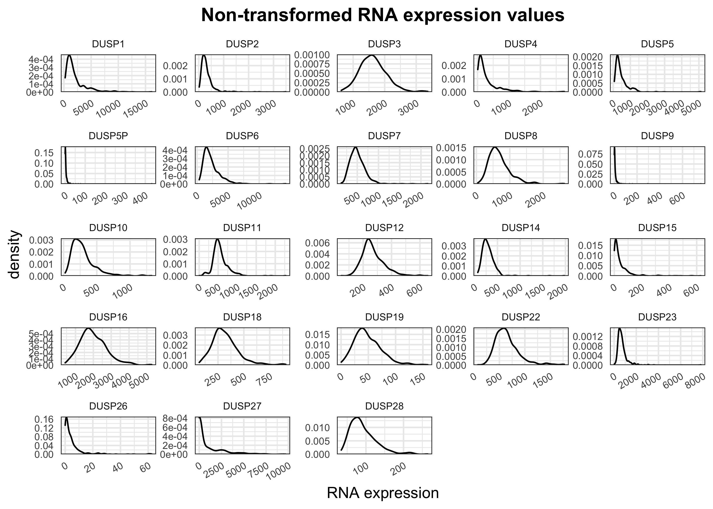
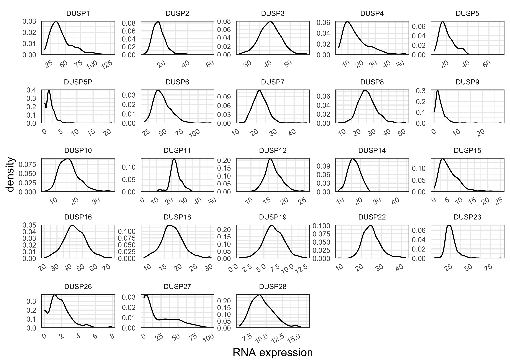
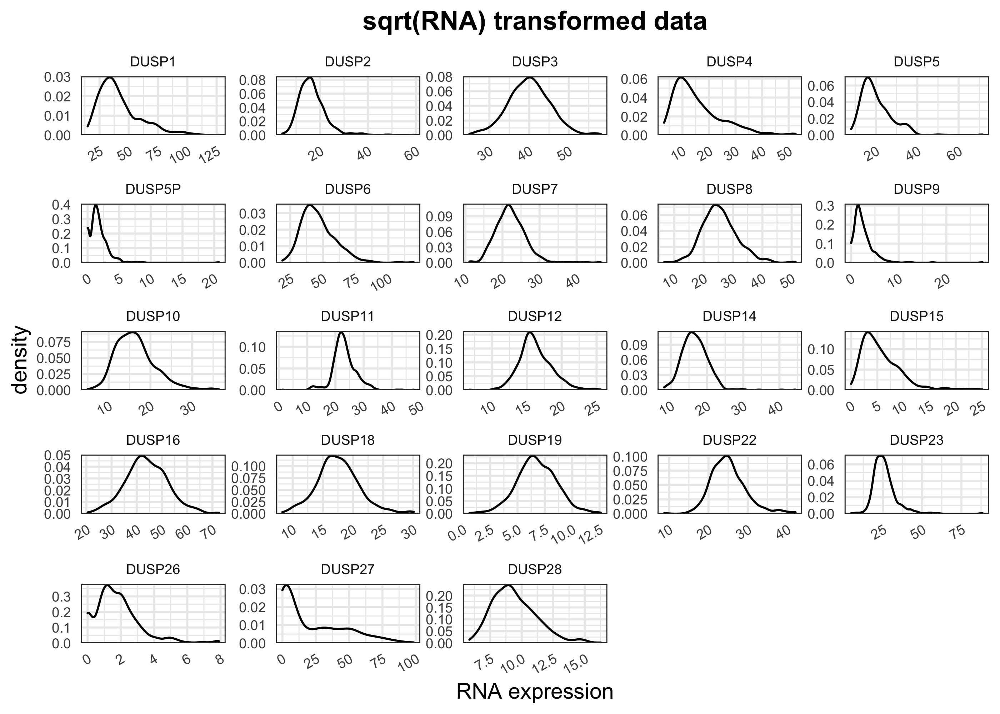
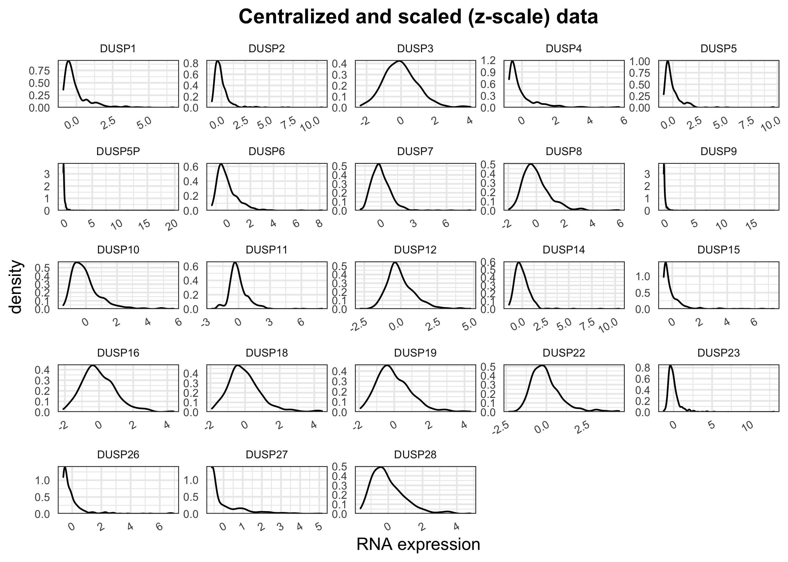
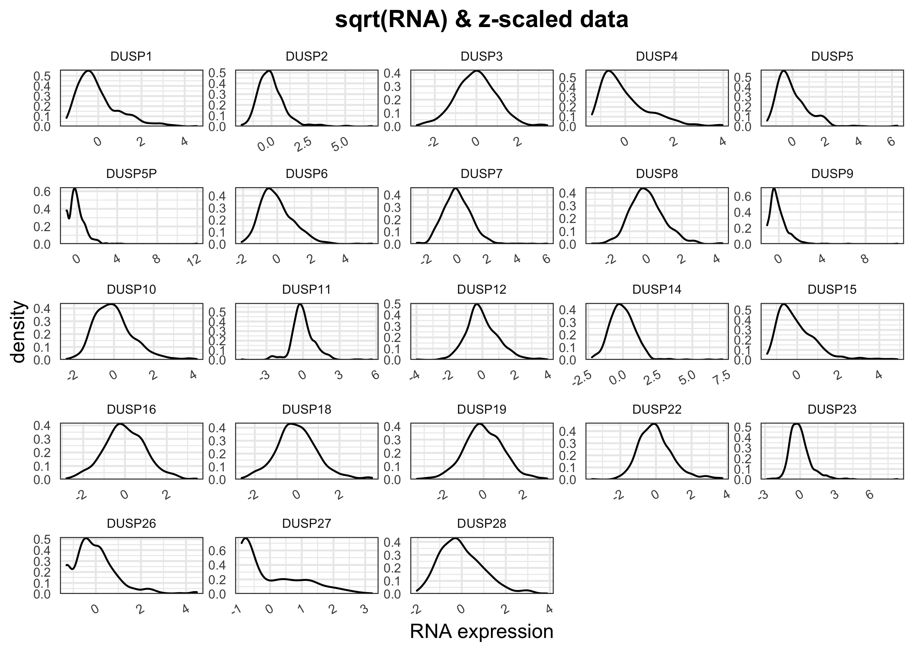
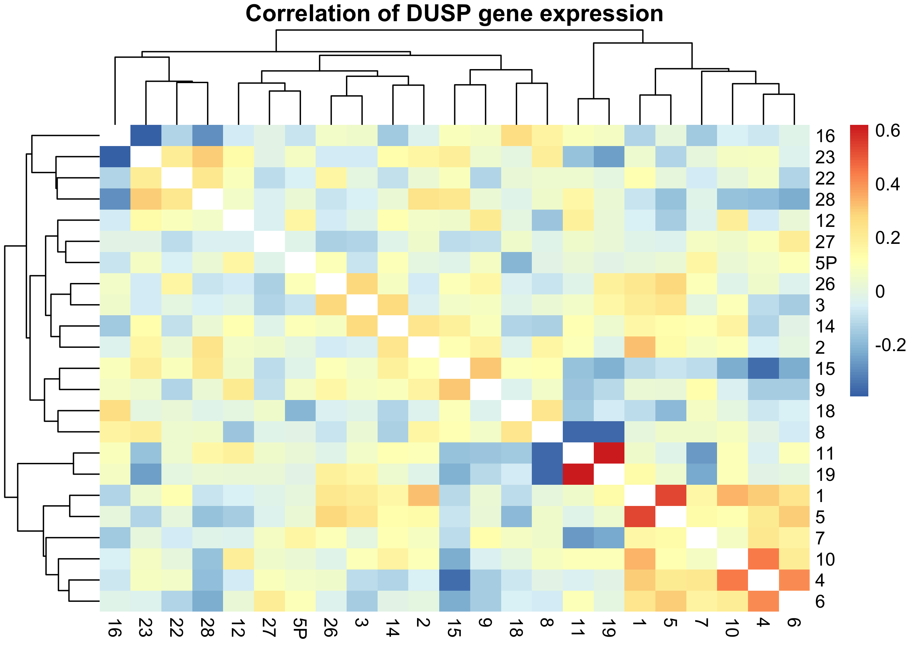
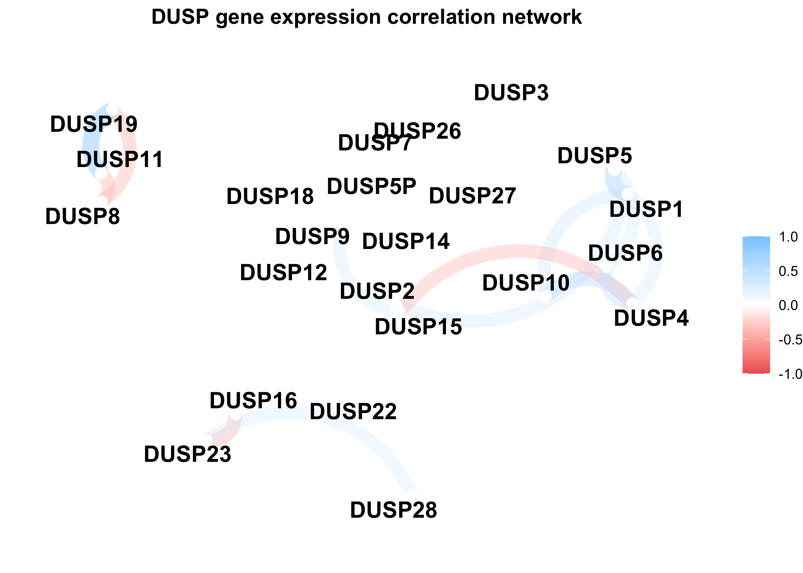
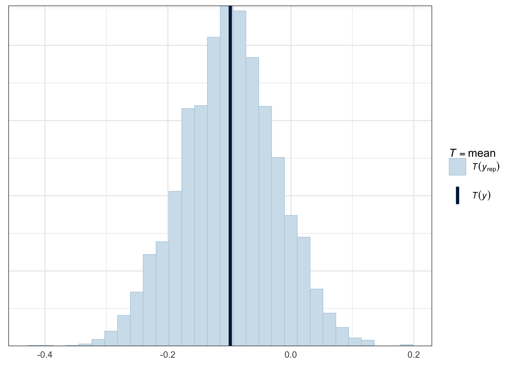
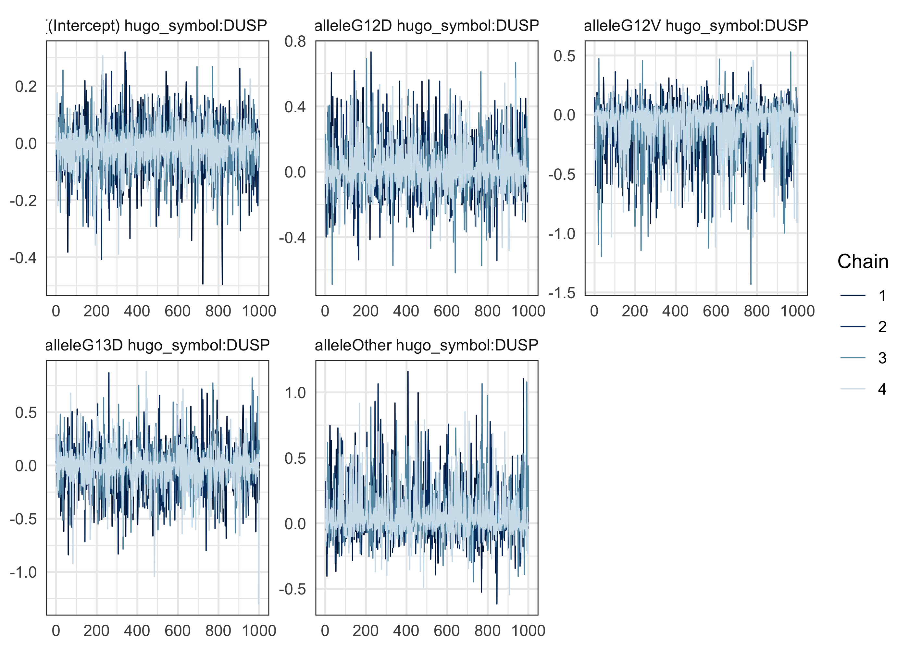
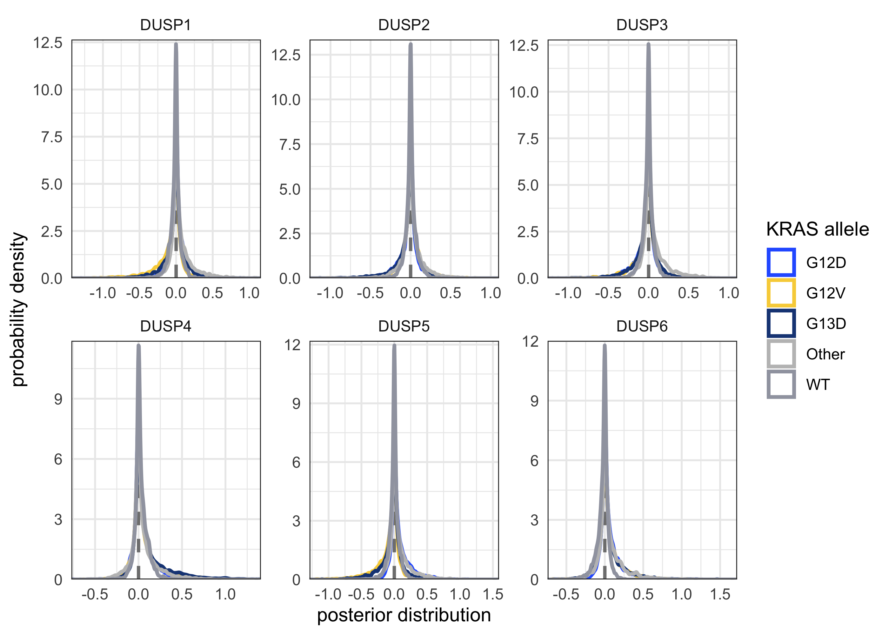

## Data preparation


```r
main_alleles <- c("WT", "KRAS_G12A", "KRAS_G12C", "KRAS_G12D", "KRAS_G12V", "KRAS_G13D")

dusp_rna_data <- readRDS("~/Downloads/coad-dusp-rna_expression.rds") %.% {
  filter(!is_hypermutant)
  select(-is_hypermutant)
  mutate(
    allele = ifelse(ras_allele %in% !!main_alleles, ras_allele, "Other"),
    allele = str_remove(allele, "KRAS_"),
    allele = factor_alleles(allele)
  )
}

# Put DUSP genes in order.
dusp_order <- unique(dusp_rna_data$hugo_symbol)
dusp_num <- as.numeric(str_remove_all(dusp_order, "[:alpha:]"))
dusp_order <- dusp_order[order(dusp_num)]
dusp_rna_data$hugo_symbol <- factor(dusp_rna_data$hugo_symbol, levels = dusp_order)
```

A sample of the RNA expression data table.


```r
dusp_rna_data %>%
  rename(
    `DUSP` = hugo_symbol,
    `tumor sample` = tumor_sample_barcode,
    `RNA (RSEM)` = rna_expr
  ) %>%
  select(-ras_allele) %>%
  head() %>%
  kbl() %>%
  kable_styling(bootstrap_options = c("striped", "hover"))
```

<table class="table table-striped table-hover" style="margin-left: auto; margin-right: auto;">
 <thead>
  <tr>
   <th style="text-align:left;"> DUSP </th>
   <th style="text-align:left;"> tumor sample </th>
   <th style="text-align:right;"> RNA (RSEM) </th>
   <th style="text-align:left;"> allele </th>
  </tr>
 </thead>
<tbody>
  <tr>
   <td style="text-align:left;"> DUSP10 </td>
   <td style="text-align:left;"> TCGA-3L-AA1B </td>
   <td style="text-align:right;"> 254.352 </td>
   <td style="text-align:left;"> WT </td>
  </tr>
  <tr>
   <td style="text-align:left;"> DUSP10 </td>
   <td style="text-align:left;"> TCGA-4N-A93T </td>
   <td style="text-align:right;"> 133.527 </td>
   <td style="text-align:left;"> G12D </td>
  </tr>
  <tr>
   <td style="text-align:left;"> DUSP10 </td>
   <td style="text-align:left;"> TCGA-4T-AA8H </td>
   <td style="text-align:right;"> 275.635 </td>
   <td style="text-align:left;"> G12V </td>
  </tr>
  <tr>
   <td style="text-align:left;"> DUSP10 </td>
   <td style="text-align:left;"> TCGA-5M-AAT4 </td>
   <td style="text-align:right;"> 507.745 </td>
   <td style="text-align:left;"> G12D </td>
  </tr>
  <tr>
   <td style="text-align:left;"> DUSP10 </td>
   <td style="text-align:left;"> TCGA-5M-AAT5 </td>
   <td style="text-align:right;"> 572.762 </td>
   <td style="text-align:left;"> G12D </td>
  </tr>
  <tr>
   <td style="text-align:left;"> DUSP10 </td>
   <td style="text-align:left;"> TCGA-5M-AATA </td>
   <td style="text-align:right;"> 209.145 </td>
   <td style="text-align:left;"> WT </td>
  </tr>
</tbody>
</table>

The number of tumor samples with missing data for each *DUSP* gene.


```r
dusp_rna_data %>%
  filter(is.na(rna_expr)) %>%
  count(hugo_symbol, sort = TRUE) %>%
  rename(DUSP = hugo_symbol, num = n) %>%
  kbl() %>%
  kable_paper(bootstrap_options = "striped", full_width = FALSE, position = "left")
```

<table class=" lightable-paper" style='font-family: "Arial Narrow", arial, helvetica, sans-serif; width: auto !important; '>
 <thead>
  <tr>
   <th style="text-align:left;"> DUSP </th>
   <th style="text-align:right;"> num </th>
  </tr>
 </thead>
<tbody>
  <tr>
   <td style="text-align:left;"> DUSP13 </td>
   <td style="text-align:right;"> 149 </td>
  </tr>
  <tr>
   <td style="text-align:left;"> DUSP21 </td>
   <td style="text-align:right;"> 149 </td>
  </tr>
</tbody>
</table>

The number of tumor samples with 0 RNA expression values for each *DUSP* gene.


```r
dusp_rna_data %>%
  filter(rna_expr <= 0) %>%
  count(hugo_symbol) %>%
  rename(DUSP = hugo_symbol, num = n) %>%
  kbl() %>%
  kable_paper(bootstrap_options = "striped", full_width = FALSE, position = "left")
```

<table class=" lightable-paper" style='font-family: "Arial Narrow", arial, helvetica, sans-serif; width: auto !important; '>
 <thead>
  <tr>
   <th style="text-align:left;"> DUSP </th>
   <th style="text-align:right;"> num </th>
  </tr>
 </thead>
<tbody>
  <tr>
   <td style="text-align:left;"> DUSP5P </td>
   <td style="text-align:right;"> 73 </td>
  </tr>
  <tr>
   <td style="text-align:left;"> DUSP9 </td>
   <td style="text-align:right;"> 34 </td>
  </tr>
  <tr>
   <td style="text-align:left;"> DUSP13 </td>
   <td style="text-align:right;"> 217 </td>
  </tr>
  <tr>
   <td style="text-align:left;"> DUSP15 </td>
   <td style="text-align:right;"> 2 </td>
  </tr>
  <tr>
   <td style="text-align:left;"> DUSP21 </td>
   <td style="text-align:right;"> 284 </td>
  </tr>
  <tr>
   <td style="text-align:left;"> DUSP26 </td>
   <td style="text-align:right;"> 58 </td>
  </tr>
  <tr>
   <td style="text-align:left;"> DUSP27 </td>
   <td style="text-align:right;"> 11 </td>
  </tr>
</tbody>
</table>

All negative RNA expressionvalues were set to 0.


```r
dusp_rna_data %<>% mutate(rna_expr = map_dbl(rna_expr, ~ max(0, .x)))
```

### Inspect the distribution of RNA expression values


```r
dusp_rna_data %>%
  filter(!is.na(rna_expr)) %>%
  mutate(rna_expr = rna_expr + 1) %>%
  ggplot(aes(x = allele, y = rna_expr)) +
  facet_wrap(~hugo_symbol, scales = "free_y") +
  geom_boxplot(outlier.shape = NA) +
  scale_y_continuous(trans = "log10") +
  theme(
    panel.grid.major.x = element_blank(),
    axis.text = element_text(size = 8),
    axis.text.x = element_text(angle = 45, hjust = 1)
  ) +
  labs(x = NULL, y = "RNA expression (log10 + 1)")
```

<!-- -->

*DUSP13* and *DUSP21* were removed from the analysis because they were missing data and had very low expression levels.


```r
IGNORE_DUSPS <- c("DUSP13", "DUSP21")
dusp_rna_data %<>% filter(!hugo_symbol %in% IGNORE_DUSPS)
```


```r
plot_dusp_distribtions <- function(df, x) {
  df %>%
    ggplot(aes(x = {{ x }})) +
    facet_wrap(~hugo_symbol, scales = "free") +
    scale_y_continuous(expand = expansion(c(0, 0.02))) +
    geom_density() +
    theme(
      plot.title = element_text(hjust = 0.5, face = "bold"),
      axis.text = element_text(size = 7),
      axis.text.x = element_text(angle = 30, hjust = 1),
      strip.text = element_text(size = 7),
      panel.spacing = unit(1, "mm")
    ) +
    labs(x = "RNA expression")
}

plot_dusp_distribtions(dusp_rna_data, rna_expr) +
  ggtitle("Non-transformed RNA expression values")
```

<!-- -->


```r
dusp_rna_data %>%
  mutate(rna_expr = log10(rna_expr + 1)) %>%
  plot_dusp_distribtions(rna_expr) +
  ggtitle("log10(RNA + 1) transformed data")
```

<!-- -->


```r
dusp_rna_data %>%
  mutate(rna_expr = sqrt(rna_expr)) %>%
  plot_dusp_distribtions(rna_expr) +
  ggtitle("sqrt(RNA) transformed data")
```

<!-- -->


```r
dusp_rna_data %>%
  group_by(hugo_symbol) %>%
  mutate(rna_expr = scale_numeric(rna_expr)) %>%
  ungroup() %>%
  plot_dusp_distribtions(rna_expr)+
  ggtitle("Centralized and scaled (z-scale) data")
```

<!-- -->


```r
dusp_rna_data %>%
  mutate(rna_expr = sqrt(rna_expr)) %>%
  group_by(hugo_symbol) %>%
  mutate(rna_expr = scale_numeric(rna_expr)) %>%
  ungroup() %>%
  plot_dusp_distribtions(rna_expr)+
  ggtitle("sqrt(RNA) & z-scaled data")
```

<!-- -->

The $\log_10(\text{RNA} + 1)$, centralized, and scaled values will be used for the analysis.


```r
dusp_rna_data %<>%
  mutate(log10_rna_expr = log10(rna_expr + 1)) %>%
  group_by(hugo_symbol) %>%
  mutate(log10_z_rna = scale_numeric(log10_rna_expr)) %>%
  ungroup()
```

## Check for correlations in *DUSP* expression


```r
dusp_corr <- dusp_rna_data %>%
  pivot_wider(id = tumor_sample_barcode, names_from = hugo_symbol, values_from = log10_z_rna) %>%
  select(-tumor_sample_barcode) %>%
  corrr::correlate() 
```

```
#> 
#> Correlation method: 'pearson'
#> Missing treated using: 'pairwise.complete.obs'
```

```r
dusp_corr_pheat <- dusp_corr %>%
  as.data.frame() %>%
  column_to_rownames("rowname")
colnames(dusp_corr_pheat) <- str_remove(colnames(dusp_corr_pheat), "DUSP")
rownames(dusp_corr_pheat) <- str_remove(rownames(dusp_corr_pheat), "DUSP")
pheatmap::pheatmap(
  dusp_corr_pheat,
  border_color = NA,
  na_col = "white",
  main = "Correlation of DUSP gene expression",
)
```

<!-- -->

```r
corrr::network_plot(dusp_corr, min_cor = 0.3) +
  theme(plot.title = element_text(hjust = 0.5, face="bold")) +
  labs(title = "DUSP gene expression correlation network")
```

<!-- -->


## Modeling


```r
new_allele_order <- as.character(sort(unique(dusp_rna_data$allele)))
new_allele_order <- c("WT", new_allele_order[new_allele_order != "WT"])

data <- dusp_rna_data %>%
  mutate(
    grp_allele = case_when(
      allele == "G13D" ~ "G13D",
      allele == "WT" ~ "WT",
      TRUE ~ "KRAS"
    ),
    grp_allele = factor(grp_allele, levels = c("WT", "G13D", "KRAS")),
    allele = factor(as.character(allele), levels = new_allele_order)
  )

# FOR TESTING
set.seed(0)
TESTING_DUSPS <- paste0("DUSP", 1:6)
TESTING_TSBS <- sample(unique(data$tumor_sample_barcode), 50)
data <- data %.%{
  filter(hugo_symbol %in% TESTING_DUSPS)
  filter(tumor_sample_barcode %in% TESTING_TSBS)
}
```


```r
stash("m1", depends_on = "data", {
  m1 <- stan_glmer(log10_z_rna ~ (1 + allele|hugo_symbol), data = data)
})
```

```
#> Loading stashed object.
```


```r
mcmc_trace(m1, pars = "(Intercept)") / mcmc_trace(m1, pars = "sigma")
```

<!-- -->

```r
mcmc_trace(m1, regex_pars = "DUSP1")
```

<!-- -->


```r
pp_check(m1, plotfun = "stat", stat = "mean")
```

```
#> `stat_bin()` using `bins = 30`. Pick better value with `binwidth`.
```

<!-- -->


```r
pp_check(m1, plotfun = "stat_2d", stat = c("mean", "sd"))
```

<!-- -->


```r
as.data.frame(m1) %.% {
  mutate(draw = row_number())
  select(draw, `(Intercept)`, tidyselect::contains("DUSP"))
  pivot_longer(
    -c(draw, `(Intercept)`), 
    names_to = "parameter", 
    values_to = "value"
  )
  mutate(
    parameter = str_remove_all(parameter, "[:punct:]"), 
    parameter = str_remove_all(parameter, "b|allele|hugosymbol|")
  )
  separate(parameter, c("allele", "dusp"), sep=" ")
  mutate(allele = str_replace(allele, "Intercept", "WT"))
} %>%
  ggplot(aes(value)) +
  facet_wrap(~ dusp, scales = "free") +
  geom_vline(xintercept = 0, lty = 2, color = "grey50", size = 0.9) +
  geom_density(aes(color = allele), size = 1) +
  scale_color_manual(values = short_allele_pal) +
  scale_x_continuous(expand = c(0, 0)) +
  scale_y_continuous(expand = expansion(c(0, 0.02))) +
  labs(x = "posterior distribution", y = "probability density", color = "KRAS allele")
```

<!-- -->


```r
bayestestR::describe_posterior(m1, effects = "all")
```

```
#> Possible multicollinearity between Sigma[hugo_symbol:alleleG13D,alleleG13D] and Sigma[hugo_symbol:alleleG12V,alleleG12V] (r = 0.83), Sigma[hugo_symbol:alleleOther,alleleOther] and Sigma[hugo_symbol:alleleG13D,alleleG13D] (r = 0.78). This might lead to inappropriate results. See 'Details' in '?rope'.
```

<div data-pagedtable="false">
  <script data-pagedtable-source type="application/json">
{"columns":[{"label":[""],"name":["_rn_"],"type":[""],"align":["left"]},{"label":["Parameter"],"name":[1],"type":["chr"],"align":["left"]},{"label":["Effects"],"name":[2],"type":["chr"],"align":["left"]},{"label":["Median"],"name":[3],"type":["dbl"],"align":["right"]},{"label":["CI"],"name":[4],"type":["dbl"],"align":["right"]},{"label":["CI_low"],"name":[5],"type":["dbl"],"align":["right"]},{"label":["CI_high"],"name":[6],"type":["dbl"],"align":["right"]},{"label":["pd"],"name":[7],"type":["dbl"],"align":["right"]},{"label":["ROPE_CI"],"name":[8],"type":["dbl"],"align":["right"]},{"label":["ROPE_low"],"name":[9],"type":["dbl"],"align":["right"]},{"label":["ROPE_high"],"name":[10],"type":["dbl"],"align":["right"]},{"label":["ROPE_Percentage"],"name":[11],"type":["dbl"],"align":["right"]},{"label":["Rhat"],"name":[12],"type":["dbl"],"align":["right"]},{"label":["ESS"],"name":[13],"type":["dbl"],"align":["right"]}],"data":[{"1":"(Intercept)","2":"fixed","3":"-1.020180e-01","4":"89","5":"-2.021538e-01","6":"0.011855467","7":"0.93700","8":"89","9":"-0.09418404","10":"0.09418404","11":"0.4538051","12":"1.0004279","13":"3150.258","_rn_":"1"},{"1":"b[(Intercept) hugo_symbol:DUSP1]","2":"random","3":"-3.322009e-03","4":"89","5":"-1.133656e-01","6":"0.104897778","7":"0.56425","8":"89","9":"-0.09418404","10":"0.09418404","11":"0.9488908","12":"1.0004556","13":"3498.335","_rn_":"2"},{"1":"b[alleleG12D hugo_symbol:DUSP1]","2":"random","3":"2.427052e-03","4":"89","5":"-1.731892e-01","6":"0.199205415","7":"0.54175","8":"89","9":"-0.09418404","10":"0.09418404","11":"0.8096040","12":"0.9997032","13":"3425.864","_rn_":"8"},{"1":"b[alleleG12V hugo_symbol:DUSP1]","2":"random","3":"-1.991888e-02","4":"89","5":"-3.288145e-01","6":"0.134188373","7":"0.65575","8":"89","9":"-0.09418404","10":"0.09418404","11":"0.7343443","12":"1.0004713","13":"2097.068","_rn_":"14"},{"1":"b[alleleG13D hugo_symbol:DUSP1]","2":"random","3":"-1.219386e-03","4":"89","5":"-2.374952e-01","6":"0.227014250","7":"0.51975","8":"89","9":"-0.09418404","10":"0.09418404","11":"0.7458579","12":"1.0001384","13":"3347.772","_rn_":"20"},{"1":"b[alleleOther hugo_symbol:DUSP1]","2":"random","3":"1.302388e-02","4":"89","5":"-1.535039e-01","6":"0.291367447","7":"0.61300","8":"89","9":"-0.09418404","10":"0.09418404","11":"0.7635496","12":"1.0001203","13":"2477.330","_rn_":"26"},{"1":"b[(Intercept) hugo_symbol:DUSP2]","2":"random","3":"2.012635e-04","4":"89","5":"-1.043200e-01","6":"0.111316717","7":"0.50650","8":"89","9":"-0.09418404","10":"0.09418404","11":"0.9651783","12":"0.9997999","13":"3829.030","_rn_":"3"},{"1":"b[alleleG12D hugo_symbol:DUSP2]","2":"random","3":"-3.160994e-03","4":"89","5":"-1.901994e-01","6":"0.171016795","7":"0.54900","8":"89","9":"-0.09418404","10":"0.09418404","11":"0.8303847","12":"1.0000014","13":"4260.989","_rn_":"9"},{"1":"b[alleleG12V hugo_symbol:DUSP2]","2":"random","3":"-2.013857e-04","4":"89","5":"-2.020301e-01","6":"0.208418357","7":"0.50400","8":"89","9":"-0.09418404","10":"0.09418404","11":"0.7871384","12":"1.0000359","13":"5110.221","_rn_":"15"},{"1":"b[alleleG13D hugo_symbol:DUSP2]","2":"random","3":"-2.871628e-03","4":"89","5":"-2.430732e-01","6":"0.196822292","7":"0.54400","8":"89","9":"-0.09418404","10":"0.09418404","11":"0.7669194","12":"1.0005367","13":"3261.962","_rn_":"21"},{"1":"b[alleleOther hugo_symbol:DUSP2]","2":"random","3":"6.819979e-04","4":"89","5":"-1.964986e-01","6":"0.222410535","7":"0.51325","8":"89","9":"-0.09418404","10":"0.09418404","11":"0.7871384","12":"0.9994105","13":"2788.925","_rn_":"27"},{"1":"b[(Intercept) hugo_symbol:DUSP3]","2":"random","3":"-2.282496e-03","4":"89","5":"-1.222632e-01","6":"0.097801673","7":"0.55300","8":"89","9":"-0.09418404","10":"0.09418404","11":"0.9590003","12":"0.9996505","13":"3699.982","_rn_":"4"},{"1":"b[alleleG12D hugo_symbol:DUSP3]","2":"random","3":"-8.416234e-03","4":"89","5":"-2.328728e-01","6":"0.154647177","7":"0.58675","8":"89","9":"-0.09418404","10":"0.09418404","11":"0.7955630","12":"0.9997708","13":"4554.277","_rn_":"10"},{"1":"b[alleleG12V hugo_symbol:DUSP3]","2":"random","3":"-8.081856e-03","4":"89","5":"-2.725711e-01","6":"0.166137743","7":"0.58725","8":"89","9":"-0.09418404","10":"0.09418404","11":"0.7674810","12":"1.0006823","13":"2983.357","_rn_":"16"},{"1":"b[alleleG13D hugo_symbol:DUSP3]","2":"random","3":"-5.718384e-03","4":"89","5":"-2.569848e-01","6":"0.187369148","7":"0.56575","8":"89","9":"-0.09418404","10":"0.09418404","11":"0.7596181","12":"1.0004994","13":"3171.646","_rn_":"22"},{"1":"b[alleleOther hugo_symbol:DUSP3]","2":"random","3":"1.262240e-02","4":"89","5":"-1.668028e-01","6":"0.270608904","7":"0.61150","8":"89","9":"-0.09418404","10":"0.09418404","11":"0.7596181","12":"0.9997056","13":"2404.313","_rn_":"28"},{"1":"b[(Intercept) hugo_symbol:DUSP4]","2":"random","3":"1.087803e-02","4":"89","5":"-7.648316e-02","6":"0.144627701","7":"0.64425","8":"89","9":"-0.09418404","10":"0.09418404","11":"0.8994664","12":"0.9999886","13":"3368.094","_rn_":"5"},{"1":"b[alleleG12D hugo_symbol:DUSP4]","2":"random","3":"8.978370e-03","4":"89","5":"-1.412304e-01","6":"0.254316870","7":"0.60625","8":"89","9":"-0.09418404","10":"0.09418404","11":"0.7888234","12":"1.0000660","13":"2835.501","_rn_":"11"},{"1":"b[alleleG12V hugo_symbol:DUSP4]","2":"random","3":"1.273615e-02","4":"89","5":"-1.810369e-01","6":"0.326597232","7":"0.61600","8":"89","9":"-0.09418404","10":"0.09418404","11":"0.7315361","12":"0.9998390","13":"2141.873","_rn_":"17"},{"1":"b[alleleG13D hugo_symbol:DUSP4]","2":"random","3":"2.849647e-02","4":"89","5":"-1.315713e-01","6":"0.435432346","7":"0.69450","8":"89","9":"-0.09418404","10":"0.09418404","11":"0.6998034","12":"0.9998821","13":"1507.595","_rn_":"23"},{"1":"b[alleleOther hugo_symbol:DUSP4]","2":"random","3":"7.980546e-03","4":"89","5":"-1.480032e-01","6":"0.324687178","7":"0.58025","8":"89","9":"-0.09418404","10":"0.09418404","11":"0.7652345","12":"1.0001853","13":"2170.777","_rn_":"29"},{"1":"b[(Intercept) hugo_symbol:DUSP5]","2":"random","3":"-7.926921e-04","4":"89","5":"-1.125906e-01","6":"0.117511967","7":"0.51750","8":"89","9":"-0.09418404","10":"0.09418404","11":"0.9438360","12":"0.9997647","13":"3669.691","_rn_":"6"},{"1":"b[alleleG12D hugo_symbol:DUSP5]","2":"random","3":"1.737206e-02","4":"89","5":"-1.275385e-01","6":"0.269686782","7":"0.65750","8":"89","9":"-0.09418404","10":"0.09418404","11":"0.7652345","12":"1.0008032","13":"2118.533","_rn_":"12"},{"1":"b[alleleG12V hugo_symbol:DUSP5]","2":"random","3":"-2.210862e-02","4":"89","5":"-3.443835e-01","6":"0.138944764","7":"0.66500","8":"89","9":"-0.09418404","10":"0.09418404","11":"0.7250772","12":"1.0002985","13":"1826.631","_rn_":"18"},{"1":"b[alleleG13D hugo_symbol:DUSP5]","2":"random","3":"-4.874629e-03","4":"89","5":"-2.990196e-01","6":"0.190174799","7":"0.56300","8":"89","9":"-0.09418404","10":"0.09418404","11":"0.7520359","12":"1.0001092","13":"2374.914","_rn_":"24"},{"1":"b[alleleOther hugo_symbol:DUSP5]","2":"random","3":"1.351644e-02","4":"89","5":"-1.631829e-01","6":"0.296237044","7":"0.62100","8":"89","9":"-0.09418404","10":"0.09418404","11":"0.7523168","12":"1.0002454","13":"2055.143","_rn_":"30"},{"1":"b[(Intercept) hugo_symbol:DUSP6]","2":"random","3":"-7.566092e-03","4":"89","5":"-1.470893e-01","6":"0.079964688","7":"0.60825","8":"89","9":"-0.09418404","10":"0.09418404","11":"0.9194047","12":"1.0002279","13":"2527.870","_rn_":"7"},{"1":"b[alleleG12D hugo_symbol:DUSP6]","2":"random","3":"1.370705e-02","4":"89","5":"-1.128226e-01","6":"0.274295222","7":"0.63875","8":"89","9":"-0.09418404","10":"0.09418404","11":"0.7902275","12":"1.0003357","13":"2166.804","_rn_":"13"},{"1":"b[alleleG12V hugo_symbol:DUSP6]","2":"random","3":"8.250102e-03","4":"89","5":"-1.644193e-01","6":"0.309545283","7":"0.57725","8":"89","9":"-0.09418404","10":"0.09418404","11":"0.7497894","12":"1.0004011","13":"2239.872","_rn_":"19"},{"1":"b[alleleG13D hugo_symbol:DUSP6]","2":"random","3":"1.082931e-02","4":"89","5":"-1.977732e-01","6":"0.293502828","7":"0.60475","8":"89","9":"-0.09418404","10":"0.09418404","11":"0.7433305","12":"1.0017371","13":"1981.212","_rn_":"25"},{"1":"b[alleleOther hugo_symbol:DUSP6]","2":"random","3":"1.372110e-02","4":"89","5":"-1.572701e-01","6":"0.300858378","7":"0.62725","8":"89","9":"-0.09418404","10":"0.09418404","11":"0.7525976","12":"1.0001215","13":"2191.198","_rn_":"31"},{"1":"Sigma[hugo_symbol:(Intercept),(Intercept)]","2":"random","3":"3.088566e-03","4":"89","5":"2.769364e-09","6":"0.020156433","7":"1.00000","8":"89","9":"-0.09418404","10":"0.09418404","11":"1.0000000","12":"1.0005108","13":"1844.712","_rn_":"32"},{"1":"Sigma[hugo_symbol:alleleG12D,(Intercept)]","2":"random","3":"-1.048632e-05","4":"89","5":"-1.255364e-02","6":"0.007101372","7":"0.53275","8":"89","9":"-0.09418404","10":"0.09418404","11":"1.0000000","12":"1.0003229","13":"3431.947","_rn_":"33"},{"1":"Sigma[hugo_symbol:alleleG12V,(Intercept)]","2":"random","3":"3.120831e-08","4":"89","5":"-9.546401e-03","6":"0.008567212","7":"0.50150","8":"89","9":"-0.09418404","10":"0.09418404","11":"1.0000000","12":"1.0009940","13":"3071.914","_rn_":"35"},{"1":"Sigma[hugo_symbol:alleleG13D,(Intercept)]","2":"random","3":"-1.295462e-07","4":"89","5":"-1.072379e-02","6":"0.011428286","7":"0.50250","8":"89","9":"-0.09418404","10":"0.09418404","11":"1.0000000","12":"0.9998339","13":"3672.967","_rn_":"38"},{"1":"Sigma[hugo_symbol:alleleOther,(Intercept)]","2":"random","3":"-1.332378e-05","4":"89","5":"-1.342210e-02","6":"0.008489779","7":"0.53900","8":"89","9":"-0.09418404","10":"0.09418404","11":"1.0000000","12":"1.0006730","13":"2743.760","_rn_":"42"},{"1":"Sigma[hugo_symbol:alleleG12D,alleleG12D]","2":"random","3":"6.279344e-03","4":"89","5":"3.621822e-09","6":"0.062289441","7":"1.00000","8":"89","9":"-0.09418404","10":"0.09418404","11":"1.0000000","12":"1.0010883","13":"1694.146","_rn_":"34"},{"1":"Sigma[hugo_symbol:alleleG12V,alleleG12D]","2":"random","3":"2.178023e-07","4":"89","5":"-1.937746e-02","6":"0.020118419","7":"0.50525","8":"89","9":"-0.09418404","10":"0.09418404","11":"1.0000000","12":"1.0009466","13":"3391.467","_rn_":"36"},{"1":"Sigma[hugo_symbol:alleleG13D,alleleG12D]","2":"random","3":"2.264224e-05","4":"89","5":"-1.851819e-02","6":"0.022177066","7":"0.54650","8":"89","9":"-0.09418404","10":"0.09418404","11":"1.0000000","12":"0.9992834","13":"2639.105","_rn_":"39"},{"1":"Sigma[hugo_symbol:alleleOther,alleleG12D]","2":"random","3":"2.557729e-05","4":"89","5":"-1.689074e-02","6":"0.020561103","7":"0.55025","8":"89","9":"-0.09418404","10":"0.09418404","11":"1.0000000","12":"1.0004259","13":"2269.516","_rn_":"43"},{"1":"Sigma[hugo_symbol:alleleG12V,alleleG12V]","2":"random","3":"8.217413e-03","4":"89","5":"2.878293e-09","6":"0.084489038","7":"1.00000","8":"89","9":"-0.09418404","10":"0.09418404","11":"1.0000000","12":"1.0014892","13":"1479.199","_rn_":"37"},{"1":"Sigma[hugo_symbol:alleleG13D,alleleG12V]","2":"random","3":"4.205069e-05","4":"89","5":"-1.864030e-02","6":"0.035074878","7":"0.56325","8":"89","9":"-0.09418404","10":"0.09418404","11":"1.0000000","12":"1.0014704","13":"1950.069","_rn_":"40"},{"1":"Sigma[hugo_symbol:alleleOther,alleleG12V]","2":"random","3":"-1.282665e-05","4":"89","5":"-1.937740e-02","6":"0.022703478","7":"0.53450","8":"89","9":"-0.09418404","10":"0.09418404","11":"1.0000000","12":"0.9997171","13":"3297.422","_rn_":"44"},{"1":"Sigma[hugo_symbol:alleleG13D,alleleG13D]","2":"random","3":"8.264125e-03","4":"89","5":"2.607573e-09","6":"0.092743019","7":"1.00000","8":"89","9":"-0.09418404","10":"0.09418404","11":"1.0000000","12":"1.0020634","13":"1408.855","_rn_":"41"},{"1":"Sigma[hugo_symbol:alleleOther,alleleG13D]","2":"random","3":"3.380252e-07","4":"89","5":"-2.562079e-02","6":"0.022717770","7":"0.50425","8":"89","9":"-0.09418404","10":"0.09418404","11":"1.0000000","12":"1.0015006","13":"3860.763","_rn_":"45"},{"1":"Sigma[hugo_symbol:alleleOther,alleleOther]","2":"random","3":"7.614265e-03","4":"89","5":"4.034644e-09","6":"0.081434283","7":"1.00000","8":"89","9":"-0.09418404","10":"0.09418404","11":"1.0000000","12":"1.0016100","13":"1523.384","_rn_":"46"}],"options":{"columns":{"min":{},"max":[10]},"rows":{"min":[10],"max":[10]},"pages":{}}}
  </script>
</div>

