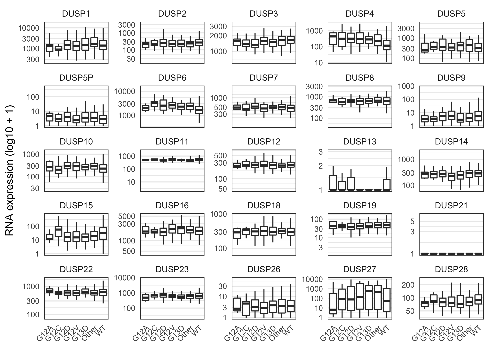
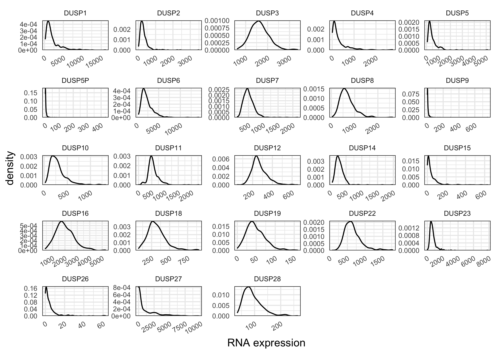
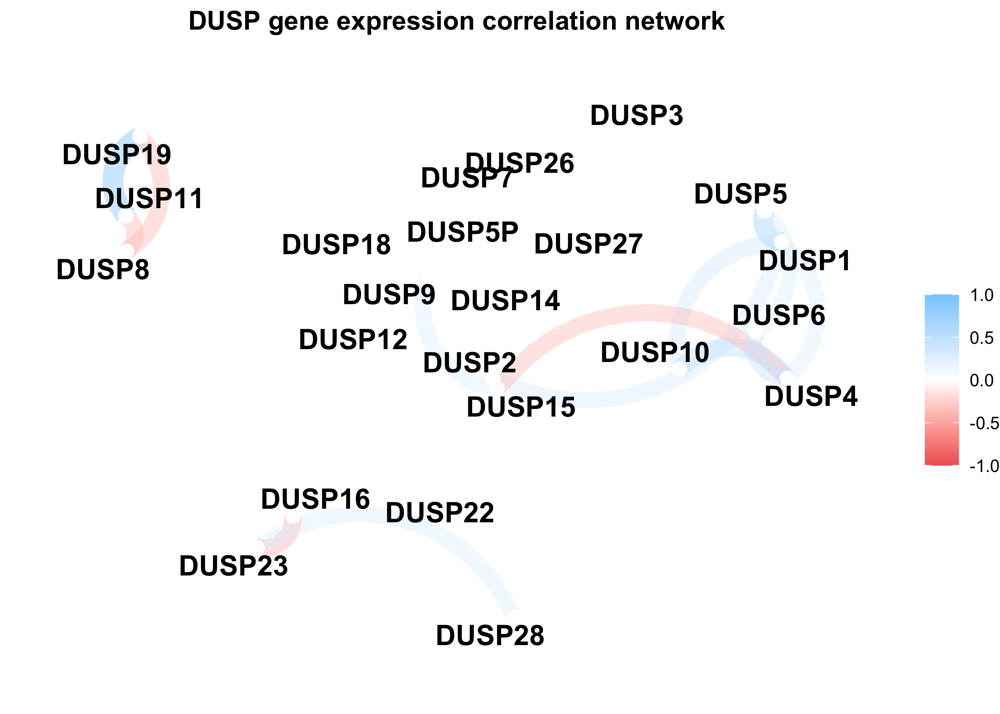
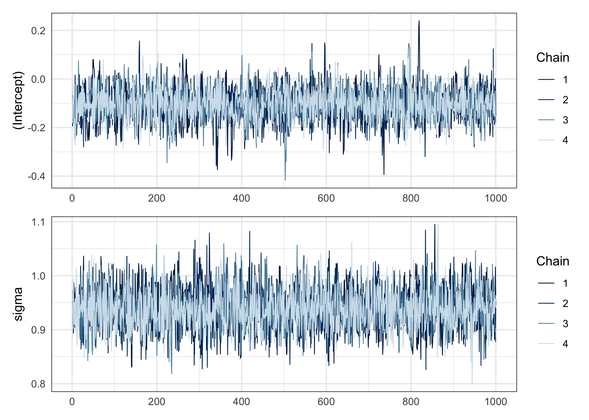
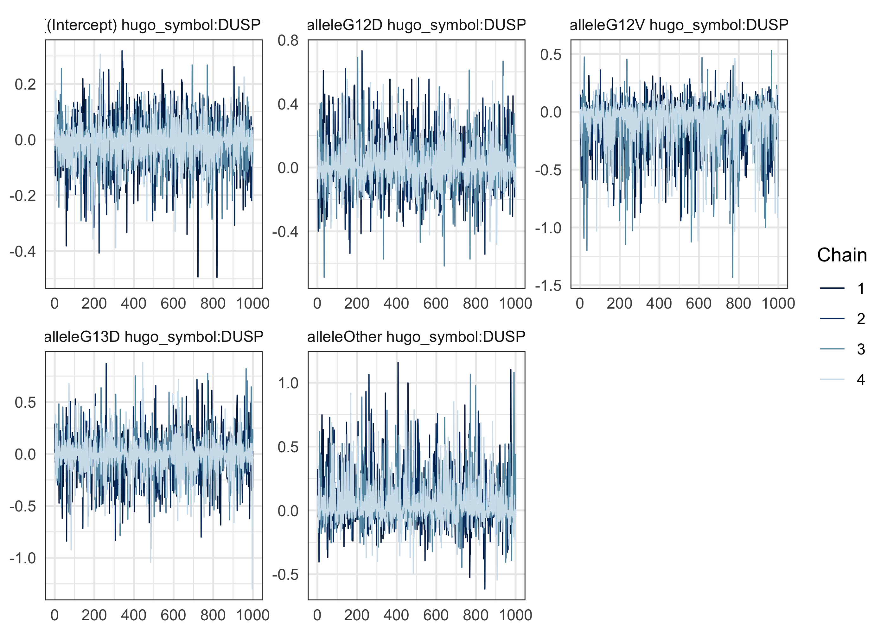

## Data preparation


```r
main_alleles <- c("WT", "KRAS_G12A", "KRAS_G12C", "KRAS_G12D", "KRAS_G12V", "KRAS_G13D")

dusp_rna_data <- readRDS("~/Downloads/coad-dusp-rna_expression.rds") %.% {
  filter(!is_hypermutant)
  select(-is_hypermutant)
  mutate(
    allele = ifelse(ras_allele %in% !!main_alleles, ras_allele, "Other"),
    allele = str_remove(allele, "KRAS_"),
    allele = factor_alleles(allele)
  )
}

# Put DUSP genes in order.
dusp_order <- unique(dusp_rna_data$hugo_symbol)
dusp_num <- as.numeric(str_remove_all(dusp_order, "[:alpha:]"))
dusp_order <- dusp_order[order(dusp_num)]
dusp_rna_data$hugo_symbol <- factor(dusp_rna_data$hugo_symbol, levels = dusp_order)
```


```r
dusp_rna_data %>%
  filter(is.na(rna_expr)) %>%
  count(hugo_symbol, sort = TRUE)
```

<div class="kable-table">

|hugo_symbol |   n|
|:-----------|---:|
|DUSP13      | 149|
|DUSP21      | 149|

</div>


```r
dusp_rna_data %>%
  filter(rna_expr <= 0) %>%
  count(hugo_symbol)
```

<div class="kable-table">

|hugo_symbol |   n|
|:-----------|---:|
|DUSP5P      |  73|
|DUSP9       |  34|
|DUSP13      | 217|
|DUSP15      |   2|
|DUSP21      | 284|
|DUSP26      |  58|
|DUSP27      |  11|

</div>

Set negative values to 0.


```r
dusp_rna_data %<>% mutate(rna_expr = map_dbl(rna_expr, ~ max(0, .x)))
```

### Inspect the distribution of RNA expression values


```r
dusp_rna_data %>%
  filter(!is.na(rna_expr)) %>%
  mutate(rna_expr = rna_expr + 1) %>%
  ggplot(aes(x = allele, y = rna_expr)) +
  facet_wrap(~hugo_symbol, scales = "free_y") +
  geom_boxplot(outlier.shape = NA) +
  scale_y_continuous(trans = "log10") +
  theme(
    panel.grid.major.x = element_blank(),
    axis.text = element_text(size = 8),
    axis.text.x = element_text(angle = 45, hjust = 1)
  ) +
  labs(x = NULL, y = "RNA expression (log10 + 1)")
```

<!-- -->

Remove *DUSP13* and *DUSP21* because they are missing data and have very low expression levels.


```r
IGNORE_DUSPS <- c("DUSP13", "DUSP21")
dusp_rna_data %<>% filter(!hugo_symbol %in% IGNORE_DUSPS)
```


```r
plot_dusp_distribtions <- function(df, x) {
  df %>%
    ggplot(aes(x = {{ x }})) +
    facet_wrap(~hugo_symbol, scales = "free") +
    scale_y_continuous(expand = expansion(c(0, 0.02))) +
    geom_density() +
    theme(
      axis.text = element_text(size = 7),
      axis.text.x = element_text(angle = 30, hjust = 1),
      strip.text = element_text(size = 7),
      panel.spacing = unit(1, "mm")
    ) +
    labs(x = "RNA expression")
}

plot_dusp_distribtions(dusp_rna_data, rna_expr)
```

<!-- -->


```r
dusp_rna_data %>%
  mutate(rna_expr = log10(rna_expr + 1)) %>%
  plot_dusp_distribtions(rna_expr)
```

<!-- -->


```r
dusp_rna_data %>%
  mutate(rna_expr = sqrt(rna_expr)) %>%
  plot_dusp_distribtions(rna_expr)
```

<!-- -->


```r
dusp_rna_data %>%
  group_by(hugo_symbol) %>%
  mutate(rna_expr = scale_numeric(rna_expr)) %>%
  ungroup() %>%
  plot_dusp_distribtions(rna_expr)
```

<!-- -->


```r
dusp_rna_data %>%
  mutate(rna_expr = sqrt(rna_expr)) %>%
  group_by(hugo_symbol) %>%
  mutate(rna_expr = scale_numeric(rna_expr)) %>%
  ungroup() %>%
  plot_dusp_distribtions(rna_expr)
```

<!-- -->

Use $\log_10(\text{RNA} + 1)$, centralized, and scaled values for the analysis.


```r
dusp_rna_data %<>%
  mutate(log10_rna_expr = log10(rna_expr + 1)) %>%
  group_by(hugo_symbol) %>%
  mutate(log10_z_rna = scale_numeric(log10_rna_expr)) %>%
  ungroup()
```

## Check for correlations in *DUSP* expression


```r
dusp_corr <- dusp_rna_data %>%
  pivot_wider(id = tumor_sample_barcode, names_from = hugo_symbol, values_from = log10_z_rna) %>%
  select(-tumor_sample_barcode) %>%
  corrr::correlate() 
```

```
#> 
#> Correlation method: 'pearson'
#> Missing treated using: 'pairwise.complete.obs'
```

```r
dusp_corr_pheat <- dusp_corr %>%
  as.data.frame() %>%
  column_to_rownames("rowname")
colnames(dusp_corr_pheat) <- str_remove(colnames(dusp_corr_pheat), "DUSP")
rownames(dusp_corr_pheat) <- str_remove(rownames(dusp_corr_pheat), "DUSP")
pheatmap::pheatmap(
  dusp_corr_pheat,
  border_color = NA,
  na_col = "white",
  main = "Correlation of DUSP gene expression",
)
```

<!-- -->

```r
corrr::network_plot(dusp_corr, min_cor = 0.3) +
  theme(plot.title = element_text(hjust = 0.5, face="bold")) +
  labs(title = "DUSP gene expression correlation network")
```

<!-- -->


## Modeling


```r
new_allele_order <- as.character(sort(unique(dusp_rna_data$allele)))
new_allele_order <- c("WT", new_allele_order[new_allele_order != "WT"])

data <- dusp_rna_data %>%
  mutate(
    grp_allele = case_when(
      allele == "G13D" ~ "G13D",
      allele == "WT" ~ "WT",
      TRUE ~ "KRAS"
    ),
    grp_allele = factor(grp_allele, levels = c("WT", "G13D", "KRAS")),
    allele = factor(as.character(allele), levels = new_allele_order)
  )

# FOR TESTING
set.seed(0)
TESTING_DUSPS <- paste0("DUSP", 1:6)
TESTING_TSBS <- sample(unique(data$tumor_sample_barcode), 50)
data <- data %.%{
  filter(hugo_symbol %in% TESTING_DUSPS)
  filter(tumor_sample_barcode %in% TESTING_TSBS)
}
```


```r
stash("m1", depends_on = "data", {
  m1 <- stan_glmer(log10_z_rna ~ (1 + allele|hugo_symbol), data = data)
})
```

```
#> Loading stashed object.
```


```r
mcmc_trace(m1, pars = "(Intercept)") / mcmc_trace(m1, pars = "sigma")
```

<!-- -->

```r
mcmc_trace(m1, regex_pars = "DUSP1")
```

<!-- -->


```r
pp_check(m1, plotfun = "stat", stat = "mean")
```

```
#> `stat_bin()` using `bins = 30`. Pick better value with `binwidth`.
```

<!-- -->


```r
pp_check(m1, plotfun = "stat_2d", stat = c("mean", "sd"))
```

<!-- -->


```r
as.data.frame(m1) %.% {
  mutate(draw = row_number())
  select(draw, `(Intercept)`, tidyselect::contains("DUSP"))
  pivot_longer(
    -c(draw, `(Intercept)`), 
    names_to = "parameter", 
    values_to = "value"
  )
  mutate(
    parameter = str_remove_all(parameter, "[:punct:]"), 
    parameter = str_remove_all(parameter, "b|allele|hugosymbol|")
  )
  separate(parameter, c("allele", "dusp"), sep=" ")
  mutate(allele = str_replace(allele, "Intercept", "WT"))
} %>%
  ggplot(aes(value)) +
  facet_wrap(~ dusp, scales = "free") +
  geom_vline(xintercept = 0, lty = 2, color = "grey50", size = 0.9) +
  geom_density(aes(color = allele), size = 1) +
  scale_color_manual(values = short_allele_pal) +
  scale_x_continuous(expand = c(0, 0)) +
  scale_y_continuous(expand = expansion(c(0, 0.02))) +
  labs(x = "posterior distribution", y = "probability density", color = "KRAS allele")
```

<!-- -->


```r
bayestestR::describe_posterior(m1, effects = "all") %>%
  knitr::kable()
```

```
#> Possible multicollinearity between Sigma[hugo_symbol:alleleG13D,alleleG13D] and Sigma[hugo_symbol:alleleG12V,alleleG12V] (r = 0.83), Sigma[hugo_symbol:alleleOther,alleleOther] and Sigma[hugo_symbol:alleleG13D,alleleG13D] (r = 0.78). This might lead to inappropriate results. See 'Details' in '?rope'.
```


|   |Parameter                                  |Effects |     Median| CI|     CI_low|   CI_high|      pd| ROPE_CI|  ROPE_low| ROPE_high| ROPE_Percentage|      Rhat|      ESS|
|:--|:------------------------------------------|:-------|----------:|--:|----------:|---------:|-------:|-------:|---------:|---------:|---------------:|---------:|--------:|
|1  |(Intercept)                                |fixed   | -0.1020180| 89| -0.2021538| 0.0118555| 0.93700|      89| -0.094184|  0.094184|       0.4538051| 1.0004279| 3150.258|
|2  |b[(Intercept) hugo_symbol:DUSP1]           |random  | -0.0033220| 89| -0.1133656| 0.1048978| 0.56425|      89| -0.094184|  0.094184|       0.9488908| 1.0004556| 3498.335|
|8  |b[alleleG12D hugo_symbol:DUSP1]            |random  |  0.0024271| 89| -0.1731892| 0.1992054| 0.54175|      89| -0.094184|  0.094184|       0.8096040| 0.9997032| 3425.864|
|14 |b[alleleG12V hugo_symbol:DUSP1]            |random  | -0.0199189| 89| -0.3288145| 0.1341884| 0.65575|      89| -0.094184|  0.094184|       0.7343443| 1.0004713| 2097.068|
|20 |b[alleleG13D hugo_symbol:DUSP1]            |random  | -0.0012194| 89| -0.2374952| 0.2270142| 0.51975|      89| -0.094184|  0.094184|       0.7458579| 1.0001384| 3347.772|
|26 |b[alleleOther hugo_symbol:DUSP1]           |random  |  0.0130239| 89| -0.1535039| 0.2913674| 0.61300|      89| -0.094184|  0.094184|       0.7635496| 1.0001203| 2477.330|
|3  |b[(Intercept) hugo_symbol:DUSP2]           |random  |  0.0002013| 89| -0.1043200| 0.1113167| 0.50650|      89| -0.094184|  0.094184|       0.9651783| 0.9997999| 3829.030|
|9  |b[alleleG12D hugo_symbol:DUSP2]            |random  | -0.0031610| 89| -0.1901994| 0.1710168| 0.54900|      89| -0.094184|  0.094184|       0.8303847| 1.0000014| 4260.989|
|15 |b[alleleG12V hugo_symbol:DUSP2]            |random  | -0.0002014| 89| -0.2020301| 0.2084184| 0.50400|      89| -0.094184|  0.094184|       0.7871384| 1.0000359| 5110.221|
|21 |b[alleleG13D hugo_symbol:DUSP2]            |random  | -0.0028716| 89| -0.2430732| 0.1968223| 0.54400|      89| -0.094184|  0.094184|       0.7669194| 1.0005367| 3261.962|
|27 |b[alleleOther hugo_symbol:DUSP2]           |random  |  0.0006820| 89| -0.1964986| 0.2224105| 0.51325|      89| -0.094184|  0.094184|       0.7871384| 0.9994105| 2788.925|
|4  |b[(Intercept) hugo_symbol:DUSP3]           |random  | -0.0022825| 89| -0.1222632| 0.0978017| 0.55300|      89| -0.094184|  0.094184|       0.9590003| 0.9996505| 3699.982|
|10 |b[alleleG12D hugo_symbol:DUSP3]            |random  | -0.0084162| 89| -0.2328728| 0.1546472| 0.58675|      89| -0.094184|  0.094184|       0.7955630| 0.9997708| 4554.277|
|16 |b[alleleG12V hugo_symbol:DUSP3]            |random  | -0.0080819| 89| -0.2725711| 0.1661377| 0.58725|      89| -0.094184|  0.094184|       0.7674810| 1.0006823| 2983.357|
|22 |b[alleleG13D hugo_symbol:DUSP3]            |random  | -0.0057184| 89| -0.2569848| 0.1873691| 0.56575|      89| -0.094184|  0.094184|       0.7596181| 1.0004994| 3171.646|
|28 |b[alleleOther hugo_symbol:DUSP3]           |random  |  0.0126224| 89| -0.1668028| 0.2706089| 0.61150|      89| -0.094184|  0.094184|       0.7596181| 0.9997056| 2404.313|
|5  |b[(Intercept) hugo_symbol:DUSP4]           |random  |  0.0108780| 89| -0.0764832| 0.1446277| 0.64425|      89| -0.094184|  0.094184|       0.8994664| 0.9999886| 3368.094|
|11 |b[alleleG12D hugo_symbol:DUSP4]            |random  |  0.0089784| 89| -0.1412304| 0.2543169| 0.60625|      89| -0.094184|  0.094184|       0.7888234| 1.0000660| 2835.501|
|17 |b[alleleG12V hugo_symbol:DUSP4]            |random  |  0.0127362| 89| -0.1810369| 0.3265972| 0.61600|      89| -0.094184|  0.094184|       0.7315361| 0.9998390| 2141.873|
|23 |b[alleleG13D hugo_symbol:DUSP4]            |random  |  0.0284965| 89| -0.1315713| 0.4354323| 0.69450|      89| -0.094184|  0.094184|       0.6998034| 0.9998821| 1507.595|
|29 |b[alleleOther hugo_symbol:DUSP4]           |random  |  0.0079805| 89| -0.1480032| 0.3246872| 0.58025|      89| -0.094184|  0.094184|       0.7652345| 1.0001853| 2170.777|
|6  |b[(Intercept) hugo_symbol:DUSP5]           |random  | -0.0007927| 89| -0.1125906| 0.1175120| 0.51750|      89| -0.094184|  0.094184|       0.9438360| 0.9997647| 3669.691|
|12 |b[alleleG12D hugo_symbol:DUSP5]            |random  |  0.0173721| 89| -0.1275385| 0.2696868| 0.65750|      89| -0.094184|  0.094184|       0.7652345| 1.0008032| 2118.533|
|18 |b[alleleG12V hugo_symbol:DUSP5]            |random  | -0.0221086| 89| -0.3443835| 0.1389448| 0.66500|      89| -0.094184|  0.094184|       0.7250772| 1.0002985| 1826.631|
|24 |b[alleleG13D hugo_symbol:DUSP5]            |random  | -0.0048746| 89| -0.2990196| 0.1901748| 0.56300|      89| -0.094184|  0.094184|       0.7520359| 1.0001092| 2374.914|
|30 |b[alleleOther hugo_symbol:DUSP5]           |random  |  0.0135164| 89| -0.1631829| 0.2962370| 0.62100|      89| -0.094184|  0.094184|       0.7523168| 1.0002454| 2055.143|
|7  |b[(Intercept) hugo_symbol:DUSP6]           |random  | -0.0075661| 89| -0.1470893| 0.0799647| 0.60825|      89| -0.094184|  0.094184|       0.9194047| 1.0002279| 2527.870|
|13 |b[alleleG12D hugo_symbol:DUSP6]            |random  |  0.0137071| 89| -0.1128226| 0.2742952| 0.63875|      89| -0.094184|  0.094184|       0.7902275| 1.0003357| 2166.804|
|19 |b[alleleG12V hugo_symbol:DUSP6]            |random  |  0.0082501| 89| -0.1644193| 0.3095453| 0.57725|      89| -0.094184|  0.094184|       0.7497894| 1.0004011| 2239.872|
|25 |b[alleleG13D hugo_symbol:DUSP6]            |random  |  0.0108293| 89| -0.1977732| 0.2935028| 0.60475|      89| -0.094184|  0.094184|       0.7433305| 1.0017371| 1981.212|
|31 |b[alleleOther hugo_symbol:DUSP6]           |random  |  0.0137211| 89| -0.1572701| 0.3008584| 0.62725|      89| -0.094184|  0.094184|       0.7525976| 1.0001215| 2191.198|
|32 |Sigma[hugo_symbol:(Intercept),(Intercept)] |random  |  0.0030886| 89|  0.0000000| 0.0201564| 1.00000|      89| -0.094184|  0.094184|       1.0000000| 1.0005108| 1844.712|
|33 |Sigma[hugo_symbol:alleleG12D,(Intercept)]  |random  | -0.0000105| 89| -0.0125536| 0.0071014| 0.53275|      89| -0.094184|  0.094184|       1.0000000| 1.0003229| 3431.947|
|35 |Sigma[hugo_symbol:alleleG12V,(Intercept)]  |random  |  0.0000000| 89| -0.0095464| 0.0085672| 0.50150|      89| -0.094184|  0.094184|       1.0000000| 1.0009940| 3071.914|
|38 |Sigma[hugo_symbol:alleleG13D,(Intercept)]  |random  | -0.0000001| 89| -0.0107238| 0.0114283| 0.50250|      89| -0.094184|  0.094184|       1.0000000| 0.9998339| 3672.967|
|42 |Sigma[hugo_symbol:alleleOther,(Intercept)] |random  | -0.0000133| 89| -0.0134221| 0.0084898| 0.53900|      89| -0.094184|  0.094184|       1.0000000| 1.0006730| 2743.760|
|34 |Sigma[hugo_symbol:alleleG12D,alleleG12D]   |random  |  0.0062793| 89|  0.0000000| 0.0622894| 1.00000|      89| -0.094184|  0.094184|       1.0000000| 1.0010883| 1694.146|
|36 |Sigma[hugo_symbol:alleleG12V,alleleG12D]   |random  |  0.0000002| 89| -0.0193775| 0.0201184| 0.50525|      89| -0.094184|  0.094184|       1.0000000| 1.0009466| 3391.467|
|39 |Sigma[hugo_symbol:alleleG13D,alleleG12D]   |random  |  0.0000226| 89| -0.0185182| 0.0221771| 0.54650|      89| -0.094184|  0.094184|       1.0000000| 0.9992834| 2639.105|
|43 |Sigma[hugo_symbol:alleleOther,alleleG12D]  |random  |  0.0000256| 89| -0.0168907| 0.0205611| 0.55025|      89| -0.094184|  0.094184|       1.0000000| 1.0004259| 2269.516|
|37 |Sigma[hugo_symbol:alleleG12V,alleleG12V]   |random  |  0.0082174| 89|  0.0000000| 0.0844890| 1.00000|      89| -0.094184|  0.094184|       1.0000000| 1.0014892| 1479.199|
|40 |Sigma[hugo_symbol:alleleG13D,alleleG12V]   |random  |  0.0000421| 89| -0.0186403| 0.0350749| 0.56325|      89| -0.094184|  0.094184|       1.0000000| 1.0014704| 1950.069|
|44 |Sigma[hugo_symbol:alleleOther,alleleG12V]  |random  | -0.0000128| 89| -0.0193774| 0.0227035| 0.53450|      89| -0.094184|  0.094184|       1.0000000| 0.9997171| 3297.422|
|41 |Sigma[hugo_symbol:alleleG13D,alleleG13D]   |random  |  0.0082641| 89|  0.0000000| 0.0927430| 1.00000|      89| -0.094184|  0.094184|       1.0000000| 1.0020634| 1408.855|
|45 |Sigma[hugo_symbol:alleleOther,alleleG13D]  |random  |  0.0000003| 89| -0.0256208| 0.0227178| 0.50425|      89| -0.094184|  0.094184|       1.0000000| 1.0015006| 3860.763|
|46 |Sigma[hugo_symbol:alleleOther,alleleOther] |random  |  0.0076143| 89|  0.0000000| 0.0814343| 1.00000|      89| -0.094184|  0.094184|       1.0000000| 1.0016100| 1523.384|

